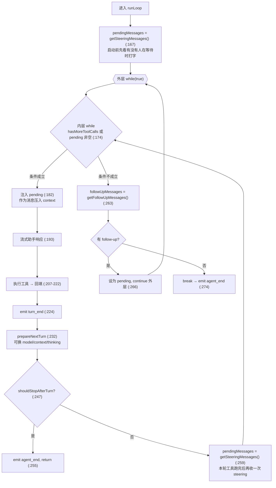
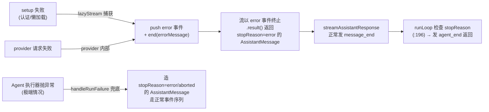

# 深入 01：Agent Loop 与事件流内核

> 配套主文档《Pi Agent 源码研习知识库》第 2 部分。本文假设你已读过主文第 2 章，聚焦
> **异步事件流机制、双层循环的边界情况、工具执行的并发/终止语义**这些"读一遍看不透"的细节。
> 所有符号名与行号对照仓库当前源码。

## 目录

- [1. EventStream：手写异步迭代器的全部机关](#1-eventstream手写异步迭代器的全部机关)
- [2. AssistantMessageEventStream：如何把"流"变成"最终消息"](#2-assistantmessageeventstream如何把流变成最终消息)
- [3. 双层循环再拆解：steering 与 follow-up 的精确时点](#3-双层循环再拆解steering-与-follow-up-的精确时点)
- [4. 截断保护：为什么 `stopReason==="length"` 要作废整批工具调用](#4-截断保护为什么-stopreasonlength-要作废整批工具调用)
- [5. 并行工具执行的两种顺序](#5-并行工具执行的两种顺序)
- [6. 提前终止 terminate 的"全票通过"语义](#6-提前终止-terminate-的全票通过语义)
- [7. 钩子链：beforeToolCall / afterToolCall / prepareNextTurn](#7-钩子链beforetoolcall--aftertoolcall--preparenextturn)
- [8. 错误如何"不抛出"地穿过整条链路](#8-错误如何不抛出地穿过整条链路)

---

## 1. EventStream：手写异步迭代器的全部机关

`packages/ai/src/utils/event-stream.ts:4` 的 `EventStream<T, R>` 是整个系统里被复用得最狠的一块基础设施：
LLM 响应流用它、Agent Loop 的输出用它。它只有 67 行，但把"生产者/消费者速度不匹配"这个经典问题解得很干净。

四个字段（`:5-11`）：

```ts
private queue: T[] = [];                                  // 生产快于消费时，事件在这里排队
private waiting: ((value: IteratorResult<T>) => void)[] = []; // 消费快于生产时，消费者的 resolve 挂在这里
private done = false;
private finalResultPromise: Promise<R>;                   // 最终结果（R），供 .result() 一次性 await
```

### push()：生产一个事件（`:21`）

```ts
push(event: T): void {
  if (this.done) return;                          // 已结束，丢弃
  if (this.isComplete(event)) {                   // 满足"完成判据"→ 解析最终结果
    this.done = true;
    this.resolveFinalResult(this.extractResult(event));
  }
  const waiter = this.waiting.shift();            // 有消费者在等 → 直接交付
  if (waiter) waiter({ value: event, done: false });
  else this.queue.push(event);                    // 没人等 → 入队
}
```

**关键点**：`isComplete` 与 `extractResult` 是构造时注入的两个策略函数——`EventStream` 本身不知道"什么算完成"，
由子类决定（见第 2 节）。这正是主文 0.2(3) 说的"用它把零散事件和最终结果统一起来"的机制。

### 异步迭代器：消费端（`:50`）

```ts
async *[Symbol.asyncIterator](): AsyncIterator<T> {
  while (true) {
    if (this.queue.length > 0) yield this.queue.shift()!;      // 队列有货，立刻吐
    else if (this.done) return;                                 // 没货且结束，收工
    else {
      // 没货但没结束：挂一个 Promise 到 waiting，等 push() 来唤醒
      const result = await new Promise<IteratorResult<T>>((resolve) => this.waiting.push(resolve));
      if (result.done) return;
      yield result.value;
    }
  }
}
```

这就是 `agent-loop.ts:317` 那句 `for await (const event of response)` 背后真正发生的事：
每次循环要么立刻从 `queue` 拿到事件，要么 `await` 一个"将来被 `push`/`end` 唤醒"的 Promise。

### end()：收尾（`:38`）

`end(result?)` 把 `done` 置真，并**唤醒所有还在等的消费者**（发 `{done:true}` 让它们的 `for await` 退出）。
若传了 `result` 且此前没有事件触发过 `isComplete`，就在这里兜底 resolve 最终结果。

> **易踩的坑**：`push` 里 `resolveFinalResult` 只在第一个 `isComplete` 事件时调用一次（Promise 只能 resolve 一次）。
> 所以"最终结果"总是**第一个**完成事件对应的值。理解这点后再看第 2 节就顺了。

---

## 2. AssistantMessageEventStream：如何把"流"变成"最终消息"

`event-stream.ts:69` 用具体策略实例化了泛型：

```ts
export class AssistantMessageEventStream extends EventStream<AssistantMessageEvent, AssistantMessage> {
  constructor() {
    super(
      (event) => event.type === "done" || event.type === "error",   // isComplete
      (event) => {
        if (event.type === "done")  return event.message;            // 成功：取 message
        if (event.type === "error") return event.error;              // 失败：取 error（也是 AssistantMessage）
        throw new Error("Unexpected event type for final result");
      },
    );
  }
}
```

对照 `AssistantMessageEvent` 的定义（主文引用 `ai/types.ts:501`）：流以 `done`（携带成功的
`AssistantMessage`）或 `error`（携带 `stopReason` 为 `"error"/"aborted"` 的 `AssistantMessage`）终止。
**无论成功失败，`.result()` 拿到的都是一个 `AssistantMessage`**——这正是 `StreamFn` 契约"错误编码进流、不抛出"
能够成立的物理基础（见第 8 节）。

回看 `agent-loop.ts:346` 处理 `done`/`error` 的分支：两者都调 `await response.result()` 拿最终消息，
再发 `message_end`。所以循环层不需要 try/catch——它只看最终 `AssistantMessage.stopReason`。

---

## 3. 双层循环再拆解：steering 与 follow-up 的精确时点

主文给了 `runLoop`（`agent-loop.ts:155`）的骨架。这里补足"两个队列到底在哪一刻被读取"这个最容易含糊的点。



**三个读取时点，语义各不相同：**

| 时点 | 行号 | 读哪个队列 | 语义 |
| --- | --- | --- | --- |
| 循环启动前 | :167 | steering | 用户可能在"上一次回复还没结束"时就打了字 |
| 每轮工具执行完、`shouldStopAfterTurn` 之后 | :259 | steering | "引导"——不打断当前轮的工具，但在**下一次** LLM 请求前注入 |
| 内层判定"本该停下"时 | :263 | follow-up | "收工后再说"——只有 agent 没有更多工具、也没有 steering 时才处理 |

`steering` 与 `follow-up` 的**队列排空策略**由 `QueueMode`（`agent/types.ts:50`）控制：`"all"` 一次全注入，
`"one-at-a-time"` 每次只取最旧一条（`agent.ts:139` 的 `PendingMessageQueue.drain`）。coding-agent 默认两者都是
`"one-at-a-time"`（`agent.ts:224-225`）。

> **为什么 `continue()` 从 assistant 结尾时要特判？** `agent.ts:360-373`：若 transcript 末条是 assistant，
> 先尝试排空 steering，再排空 follow-up，都空才报错。因为 LLM 请求必须以 user/toolResult 结尾
> （`agent-loop.ts:74` 的硬约束）。

---

## 4. 截断保护：为什么 `stopReason==="length"` 要作废整批工具调用

`agent-loop.ts:210-213` 有一段容易被略过、但设计得很仔细的逻辑：

```ts
const executedToolBatch =
  message.stopReason === "length"
    ? await failToolCallsFromTruncatedMessage(toolCalls, emit)   // 全部作废
    : await executeToolCalls(currentContext, message, config, signal, emit);
```

原因（源码注释 `:208-210` + `:374-380`）：流式工具调用的参数是**逐段拼接**的，最终用一个"尽力而为的 JSON
抢救解析器"收尾。当响应被输出 token 上限截断（`stopReason:"length"`）时，一个工具调用的参数**可能恰好解析成功、
甚至通过 schema 校验，但内容其实是残缺的**。执行这种"看起来合法、实则被截断"的调用是危险的。

`failToolCallsFromTruncatedMessage`（`:381`）因此对每个工具调用：照常发
`tool_execution_start`，但直接构造一个错误结果（`createErrorToolResult`），提示模型"响应触及输出上限、参数可能被截断，
请用完整参数重发"，再发 `tool_execution_end` + 工具结果消息。`terminate:false`——循环继续，让模型有机会重试。

---

## 5. 并行工具执行的两种顺序

`executeToolCallsParallel`（`agent-loop.ts:489`）里藏着一个"两种顺序"的精妙设计，是 `ToolExecutionMode` 文档
（`agent/types.ts:42-51`）所述语义的落地：

1. **预检是顺序的**（`:499-538`）：逐个 `prepareToolCall`（校验参数 + 跑 `beforeToolCall`）。`immediate`
   结果（工具不存在/被拦截/校验失败）立即定型；否则把"执行"包成一个 thunk 推入 `finalizedCalls`。
2. **执行是并发的**（`:540`）：`Promise.all(finalizedCalls.map(...))` 让所有 thunk 并发跑。
3. **两种顺序**：
   - `tool_execution_end` 在**每个工具完成时**发（thunk 内部，`:532`）→ **完成顺序**；
   - 工具结果消息（`ToolResultMessage`）在 `Promise.all` 全部结束后，按 `orderedFinalizedCalls` 的
     **助手消息原始顺序**发（`:543-548`）。

这样做的好处：UI 能在每个工具一完成就更新（响应快），但写入 transcript 的消息顺序保持稳定、可复现
（与模型请求它们的顺序一致）。

**何时强制串行？** `executeToolCalls`（`:419`）：只要 `config.toolExecution === "sequential"`**或**
任一被调用工具自身声明了 `executionMode: "sequential"`，整批就走串行。coding-agent 的文件写入类工具正是靠
per-tool `executionMode` + `withFileMutationQueue` 来避免并发写竞态。

---

## 6. 提前终止 terminate 的"全票通过"语义

`shouldTerminateToolBatch`（`agent-loop.ts:582`）：

```ts
return finalizedCalls.length > 0 && finalizedCalls.every((f) => f.result.terminate === true);
```

只有当本批工具结果**每一个**都 `terminate === true` 时，才终止后续循环（`hasMoreToolCalls = !terminate`，`:216`）。
这防止了"一个工具想收工、但其它工具还有后续动作"时的过早退出。`terminate` 可由工具自身
（`AgentToolResult.terminate`，`agent/types.ts:368`）或 `afterToolCall` 钩子（`AfterToolCallResult.terminate`，
`:89`）设置。

---

## 7. 钩子链：beforeToolCall / afterToolCall / prepareNextTurn

三个钩子构成了外层（coding-agent 的 `AgentSession` + 扩展系统）介入循环的主要缝隙：

| 钩子 | 触发点 | 契约 | 典型用途 |
| --- | --- | --- | --- |
| `beforeToolCall` | 参数校验后、执行前（`:619`） | 返回 `{block:true, reason?}` 即拦截，循环改发错误结果 | 权限审批、危险命令确认 |
| `afterToolCall` | 执行后、发 `tool_execution_end` 前（`:720`） | 按字段覆盖 content/details/usage/terminate/isError（**无深合并**） | 结果改写、脱敏、注入提示 |
| `prepareNextTurn` | `turn_end` 后、下一次请求前（`:232`） | 返回 `{context?, model?, thinkingLevel?}` 快照 | 每轮重建 system prompt/tools（`AgentSession._installAgentNextTurnRefresh`）、动态换模型 |

`prepareNextTurn` 的 thinkingLevel 处理有个细节（`:238-244`）：返回 `"off"` 会被转成 `undefined`
（即"不带 reasoning 参数请求"），而返回 `undefined` 表示"沿用当前"。两者不是一回事。

`afterToolCall` 的合并语义（`agent/types.ts:79-90` + `agent-loop.ts:733-742`）逐字段覆盖，
省略的字段保留原值，**content/details/usage 不做深合并**——想改就得给完整值。

---

## 8. 错误如何"不抛出"地穿过整条链路

把前面的碎片拼成一条完整的"错误不抛出"链，这是 Pi 稳健性的核心设计：



三道防线：

1. **`lazyStream`（`api/lazy.ts:46`）**：同步返回一个空流，背后 `setup().then(forward).catch(...)`。
   setup 抛错时（如认证解析失败），`createSetupErrorMessage`（`:4`）造一条 `stopReason:"error"` 的助手消息，
   `push` 一个 error 事件并 `end`。**认证失败因此表现为一次正常的"错误回复"，而非崩溃。** `ModelRuntime.streamSimple`
   和 `Models.streamSimple` 都用它包裹。
2. **`StreamFn` 契约（`agent/types.ts:28`）**：一旦被调用就不得抛出，失败编码进流。`runLoop` 只看
   `stopReason`（`:196`），无需 try/catch。
3. **`Agent.handleRunFailure`（`agent.ts:496`）**：万一执行器仍抛了（不合契约的实现、或 `convertToLlm`
   抛错等），兜底造一条错误助手消息并走完整事件序列（message_start/end → turn_end → agent_end），
   保证 UI 一定收到闭环，不会卡在"正在工作"。

> **给扩展作者的提醒**：`convertToLlm` / `transformContext` / 各钩子的契约都写着"不得抛出，返回安全兜底值"
> （`agent/types.ts:154`、`:195` 等）。因为它们跑在事件序列中间，抛出会打断正常的 emit 流程，UI 状态可能卡死。

---

← 返回主文档：[Pi Agent 源码研习知识库](./pi-agent-source-study.md) ·
下一篇：[深入 02：pi-ai Provider / 认证 / 流式](./deep-02-pi-ai-provider-auth.md)
