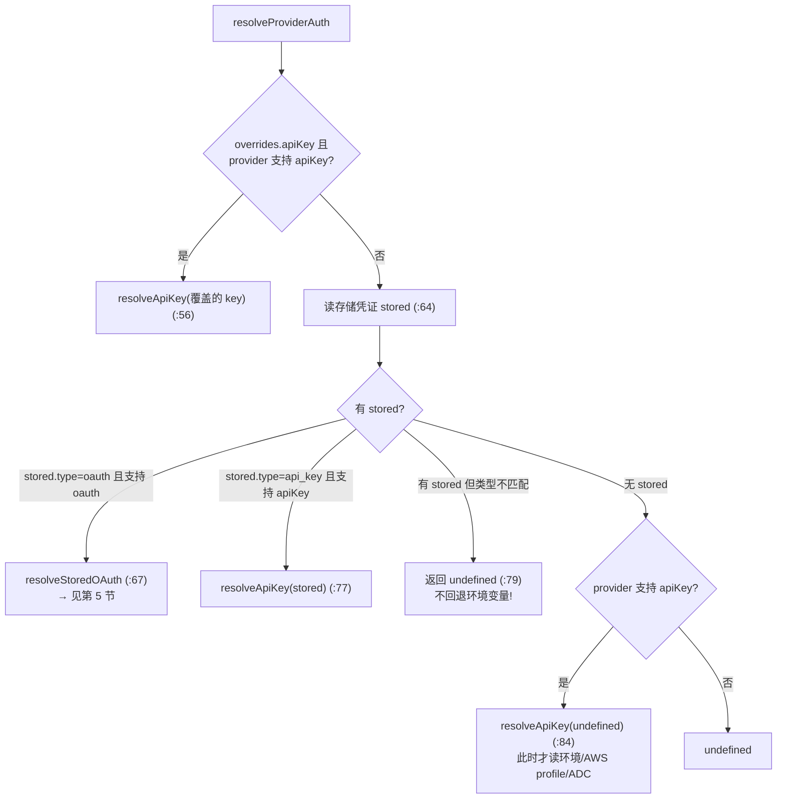

# 深入 02：pi-ai Provider / 认证 / 流式

> 配套主文档《Pi Agent 源码研习知识库》第 3 部分。聚焦 pi-ai 层三块"看名字猜不透"的机制：
> **一个真实 Provider 长什么样、认证解析（尤其 OAuth 刷新的并发安全）、compat 兼容层与 lazyStream**。
> 符号名与行号对照仓库当前源码。

## 目录

- [1. 解剖一个真实 Provider：anthropic.ts](#1-解剖一个真实-provideranthropicts)
- [2. createProvider：静态目录 + 动态覆盖 + API 分发](#2-createprovider静态目录--动态覆盖--api-分发)
- [3. 认证类型体系：Credential / ProviderAuth / AuthResult](#3-认证类型体系credential--providerauth--authresult)
- [4. resolveProviderAuth：凭证归属与"无静默回退"原则](#4-resolveproviderauth凭证归属与无静默回退原则)
- [5. OAuth 刷新的双重检查锁](#5-oauth-刷新的双重检查锁)
- [6. compat 层：api-registry 与 streamSimple 的分发路径](#6-compat-层api-registry-与-streamsimple-的分发路径)
- [7. 成本与思考等级计算](#7-成本与思考等级计算)

---

## 1. 解剖一个真实 Provider：anthropic.ts

主文说"41+ 个 provider 同构，先读 anthropic.ts 一个即可"。它只有 50 行（`packages/ai/src/providers/anthropic.ts`），
是理解整个 provider 家族的模板：

```ts
export function anthropicProvider(): Provider<"anthropic-messages"> {
  return createProvider({
    id: "anthropic",
    name: "Anthropic",
    baseUrl: "https://api.anthropic.com",
    auth: {
      apiKey: anthropicApiKeyAuth(),                                  // API key 认证方法
      oauth: lazyOAuth({ name: "Anthropic (Claude Pro/Max)", load: loadAnthropicOAuth }), // OAuth 懒加载
    },
    models: Object.values(ANTHROPIC_MODELS),                          // 来自生成的 .models.ts
    api: anthropicMessagesApi(),                                      // 该 API 的流实现
  });
}
```

三个要点：

- **模型目录来自生成文件**：`ANTHROPIC_MODELS` 来自 `anthropic.models.ts`（构建产物，主文 1.3 说"只读逻辑不读目录"）。
- **API 实现是懒加载的**：`anthropicMessagesApi()` 来自 `api/anthropic-messages.lazy.ts`——真正的 HTTP/SSE
  编解码在 `api/anthropic-messages.ts`，用到才加载，降低启动开销。
- **认证方法是一组"resolve 策略"**，不是死数据。看 `anthropicApiKeyAuth().resolve`（`:16-34`）的优先级：
  1. 已存储凭证 `credential.key`（"stored credential"）；
  2. 环境变量 `ANTHROPIC_AUTH_TOKEN`（作为 `Authorization: Bearer` 头）；
  3. 依次尝试 `ANTHROPIC_OAUTH_TOKEN`、`ANTHROPIC_API_KEY`；
  4. 都没有 → `undefined`（provider 未配置）。

> 这解释了主文 3.1 里"`Models.getAuth()` 在 provider 未配置时返回 undefined"：`resolve` 返回 `undefined` 时，
> 上层就知道这家没配好，不会把它的模型列进"可用"。

---

## 2. createProvider：静态目录 + 动态覆盖 + API 分发

`models.ts:556` 的 `createProvider` 是所有 provider（内置 + `models.json` 自定义）的统一工厂。三个机制：

### (1) 静态 baseline + 动态 overlay 合并（`:557-569`）

```ts
const baselineModels = input.models;         // 静态目录（生成文件）
let dynamicModels = [];                       // refreshModels() 拉到的动态列表
const currentModels = () => {                 // 按 id 合并：动态覆盖同 id 的静态项，否则追加
  const merged = [...baselineModels];
  for (const model of dynamicModels) {
    const i = merged.findIndex((e) => e.id === model.id);
    if (i >= 0) merged[i] = model; else merged.push(model);
  }
  return merged;
};
```

`getModels()` 返回的就是这个合并结果。静态 provider（无 `fetchModels`）的 `dynamicModels` 恒空。

### (2) refreshModels 的单飞（single-flight）与缓存（`:596-617`）

```ts
refreshModels: fetchModels ? (context) => {
  inflightRefresh ??= (async () => {          // 单飞：并发调用共享同一个 Promise
    try {
      const stored = await context.store.read();          // 先恢复上次缓存的目录
      if (stored) dynamicModels = stored.models.filter(...);
      if (!context.allowNetwork || context.signal?.aborted) return;  // 离线/取消：只用缓存
      const refreshed = await fetchModels(context);        // 联网拉新
      if (context.signal?.aborted) return;
      dynamicModels = refreshed;
      await context.store.write({ models: refreshed, checkedAt: Date.now() });  // 写回缓存
    } finally { inflightRefresh = undefined; }
  })();
  return inflightRefresh;
} : undefined,
```

**失败时保留旧列表**（`Provider.refreshModels` 契约，`:104`）：抛错前 `dynamicModels` 已被缓存恢复填充过。

### (3) 按 model.api 分发（`:570-587`）

`api` 字段可以是单个 `ProviderStreams`（所有模型走同一实现），也可以是 `Partial<Record<Api, ProviderStreams>>`
（按 `model.api` 分发，供混合 API 的 provider 用）。找不到对应实现时，`dispatch` 返回一个用 `lazyStream`
包装的错误流（`:582`）——又一次"错误编码进流、不抛出"。

---

## 3. 认证类型体系：Credential / ProviderAuth / AuthResult

`auth/types.ts` 定义了整套认证抽象。三组核心类型：

```ts
// 凭证：存储的东西
export type Credential = ApiKeyCredential | OAuthCredential;         // :37
interface ApiKeyCredential { type: "api_key"; key: string; env?: ... }         // :17
interface OAuthCredential extends OAuthCredentials { type: "oauth"; expires: number; ... } // :32

// Provider 声明的认证能力
export interface ProviderAuth { apiKey?: ApiKeyAuth; oauth?: OAuthAuth }        // :217
export type AuthType = "api_key" | "oauth";                                     // :111

// 解析后的、可直接用于请求的结果
export interface AuthResult { auth: {apiKey?, headers?, baseUrl?}; env?; source } // :98
```

- **`ApiKeyAuth`（`:161`）**：有 `resolve({ctx, credential})`（把凭证/环境变量变成 `AuthResult`）、可选 `login`、
  可选 `check`。
- **`OAuthAuth`（`:189`）**：有 `refresh(credential)`（刷新 token）、`toAuth(credential)`（把 token 变成请求头）、
  `login`。
- **`AuthResult.source`**：一个人类可读标签（"OAuth"/"stored credential"/环境变量名），用于状态 UI 显示凭证来源。

### CredentialStore：唯一写路径是 modify（`:60-91`）

```ts
export interface CredentialStore {
  read(providerId): Promise<Credential | undefined>;
  modify(providerId, fn: (current) => Promise<Credential | undefined>): Promise<Credential | undefined>;
  delete(providerId): Promise<void>;
}
```

注释（`:47-51`）点明设计意图：**`modify` 是唯一写路径，每次修改都是串行化的 read-modify-write**；
`Models.getAuth()` 把 OAuth 刷新放进 `modify` 内执行，**使并发请求不可能重复刷新一个已轮换的 token**。这是第 5 节的地基。

---

## 4. resolveProviderAuth：凭证归属与"无静默回退"原则

`auth/resolve.ts:48` 的 `resolveProviderAuth` 是认证解析的中心。它的决策树（含一条重要的安全原则）：



**核心原则（注释 `:42-46`）**：*"A stored credential owns the provider: ambient/env is consulted only when
nothing is stored. No silent env fallback after a failed refresh or for a credential type without a matching handler."*

翻译：**一旦你为某 provider 存了凭证，它就"占有"了这家的认证**。环境变量只在**完全没有存储凭证**时才被查询。
存了一个类型不匹配的凭证（如存了 oauth 但 provider 只支持 apiKey）→ 直接 `undefined`，**绝不静默退回环境变量**。
这防止了"OAuth 登录过期后，Pi 悄悄改用某个陈旧的环境变量 key"这类难以察觉的错误。

`ModelsError`（`:24`）用 `code` 区分失败类别：`"oauth"`（刷新失败，保留凭证可重试）、`"auth"`（凭证读取/api-key 失败）、
`"provider"`、`"stream"` 等。请求路径把这些 reject 转成流错误。

---

## 5. OAuth 刷新的双重检查锁

`resolveStoredOAuth`（`resolve.ts:102`）是并发安全的教科书示例。问题：多个请求同时发现 token 快过期，
不能让它们各刷各的（会互相作废、浪费配额）。

```ts
const minimumValidityMs = Math.max(DEFAULT_OAUTH_MINIMUM_VALIDITY_MS, minOAuthValidityMs ?? 0); // 默认5分钟
const expiresSoon = (c) => Date.now() + minimumValidityMs >= c.expires;
let credential = stored;

if (expiresSoon(credential)) {                       // ① 乐观检查（锁外，快速路径)
  const post = await credentials.modify(providerId, async (current) => {   // ② 进入串行化的 modify
    if (current?.type !== "oauth") return undefined;      // 期间被登出
    if (!expiresSoon(current)) return undefined;          // ③ 锁内权威检查：别人已刷过 → 不刷
    return await oauth.refresh(current);                  // ④ 全局只刷一次，返回值被持久化
  });
  if (post?.type !== "oauth") return undefined;
  credential = post;
}
return { auth: await oauth.toAuth(credential), source: "OAuth" };
```

这就是**双重检查锁**（double-checked locking）：

1. **锁外乐观检查**（`:113`）：绝大多数请求 token 还新鲜，直接跳过整段，零开销。
2. **锁内权威检查**（`:119`）：只有"快过期"的请求进 `modify`。因为 `modify` 是串行化的，
   第一个进来的刷新并持久化；后续进来的看到 `current` 已经新鲜（`!expiresSoon`）就返回 `undefined`（不刷），
   直接复用刚轮换的 token。

`minOAuthValidityMs`（`:135`）：普通请求即使刷完仍"快过期"也不报错（只是尽力），但**显式调用方**（如导出
bearer token）会强制要求刷新后满足最小有效期，否则抛 `oauth` 错。

> 这段配合第 3 节 `CredentialStore.modify` 的"唯一写路径 + 串行化"才成立。ModelRuntime 侧的
> `resolveRefreshCredential`（`models.ts:330`）在刷新模型目录时也用了同样的 `modify` 模式。

---

## 6. compat 层：api-registry 与 streamSimple 的分发路径

`compat.ts` 是**过渡兼容层**（注释 `:1-11` 明说"随 coding-agent ModelManager 迁移完成会删除"）。
但 coding-agent 现在仍从 `@earendil-works/pi-ai/compat` 导入 `streamSimple`（主文 `sdk.ts:3`），所以要懂它。

它维护一个**按 api 分发的注册表** `apiProviderRegistry`（`:100`），把每种 API（`anthropic-messages`、
`openai-responses`、…共 10 种，`:178-189`）映射到其流实现。`registerBuiltInApiProviders`（`:198`）在模块加载时
（`:213`）注册内置实现，且"不覆盖已有条目"——测试/扩展可以先注册 override。

`streamSimple`（`:275`）的分发逻辑：

```ts
export function streamSimple(model, context, options) {
  const builtinProvider = getBuiltinProviderForModel(model);       // 该 model 属于内置 provider?
  if (builtinProvider) {
    if (model.provider.startsWith("cloudflare-") && !hasResolvedCloudflareAuth(options))
      return compatModels.streamSimple(model, context, options);   // cloudflare 特例走完整 Models 认证
    return builtinProvider.streamSimple(model, context, withEnvApiKey(model, options)); // 注入环境 key
  }
  return resolveApiProvider(model.api).streamSimple(model, context, withEnvApiKey(model, options)); // 按 api 走注册表
}
```

`withEnvApiKey`（`:222`）：若 options 没显式给 key，就按 provider 从环境变量补一个（`AMBIENT_AUTH_MARKER`
`"<authenticated>"` 表示"环境已认证但无明文 key"，如 AWS profile，此时不注入）。

> **两条路径别混淆**：coding-agent 生产路径其实走的是 `ModelRuntime.streamSimple`（主文 3.2，含完整认证/header
> 编排）。`compat.streamSimple` 只作为 `setDefaultStreamFn` 的默认兜底（`sdk.ts:36`），给不显式传 streamFn 的老式扩展用。

### lazyStream 复习（`api/lazy.ts:46`）

`streamSimple` 之所以能**同步返回一个流**、却在背后做异步认证解析，全靠 `lazyStream`：它同步 new 一个空的
`AssistantMessageEventStream`，然后 `setup().then(forward).catch(errorMessage)`。这是主文与深入 01 第 8 节反复出现的
"认证失败 = 一次正常错误回复"机制的源头。

---

## 7. 成本与思考等级计算

两个纯函数，读源码时会反复遇到：

### calculateCost（`models.ts:639`）

按输入 token 总量匹配**分层价率**（`model.cost.tiers`，用于长上下文阶梯定价），再分别算
input/output/cacheRead/cacheWrite 成本。有个 Anthropic 特例（`:650-656`）：1 小时缓存写按 `input * 2` 计价
（`cacheWrite1h` 那部分），普通缓存写按 `cacheWrite` 价率。

### clampThinkingLevel（`models.ts:674`）

思考等级共 7 档：`off/minimal/low/medium/high/xhigh/max`（`EXTENDED_THINKING_LEVELS`，`:661`）。
`getSupportedThinkingLevels`（`:663`）根据 `model.reasoning` 和 `model.thinkingLevelMap` 算出该模型支持哪些档
（`null` 标记不支持；`xhigh`/`max` 需显式映射才支持）。`clampThinkingLevel` 把请求档**就近夹取**到支持的档位：
先向更高档找，再向更低档找，都没有就取第一个（通常 `off`）。coding-agent 在 `sdk.ts:242` 恢复/初始化会话时用它，
避免给不支持 `high` 的模型发 `high`。

---

← 上一篇：[深入 01：Agent Loop 与事件流内核](./deep-01-agent-loop-internals.md) ·
返回主文档：[Pi Agent 源码研习知识库](./pi-agent-source-study.md) ·
下一篇：[深入 03：TUI 差分渲染与终端输入](./deep-03-tui-diff-rendering.md)
