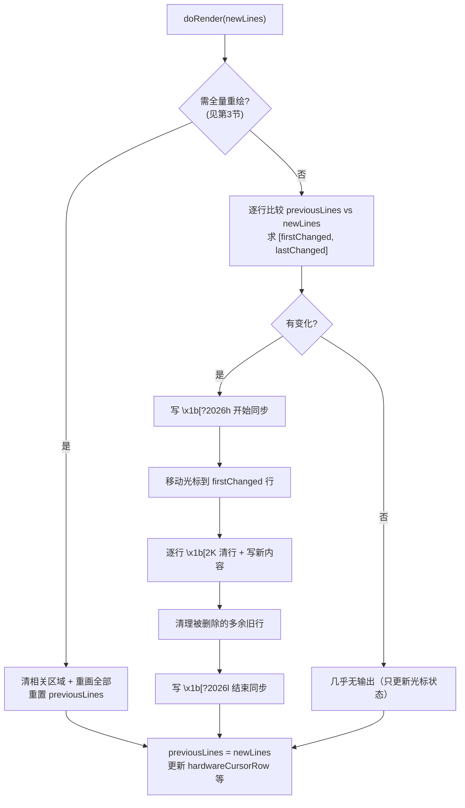
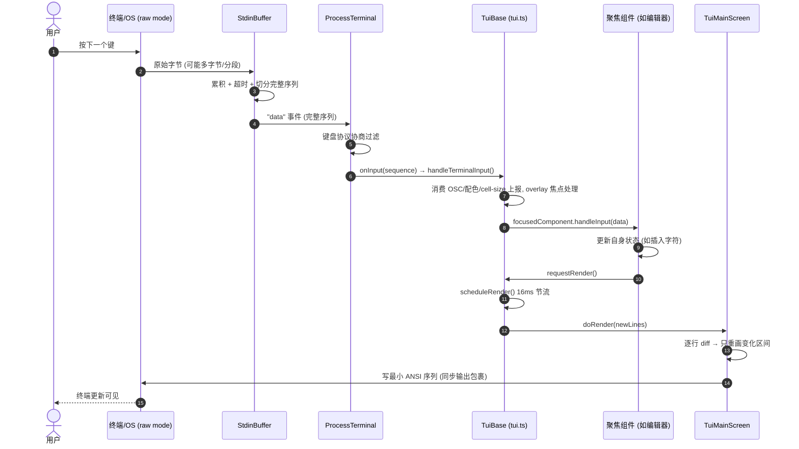

# 深入 03：TUI 差分渲染与终端输入

> 配套主文档《Pi Agent 源码研习知识库》第 5 部分。主文讲了 `TuiBase`/`Container`/`Component` 契约与
> 渲染调度（16ms 节流、`doRender()` 抽象）。本文补上**子类真正实现的逐行差分算法**、主屏 vs 备用屏的差异、
> 以及 stdin 原始字节如何被解析成按键。符号名与行号对照仓库当前源码
> （`packages/tui/src/` 下 `TuiMainScreen.ts`、`TuiAltScreen.ts`、`stdin-buffer.ts`、`terminal.ts`）。

## 目录

- [1. 为什么要差分渲染](#1-为什么要差分渲染)
- [2. TuiMainScreen：主屏的逐行差分算法](#2-tuimainscreen主屏的逐行差分算法)
- [3. 何时被迫全量重绘](#3-何时被迫全量重绘)
- [4. TuiAltScreen：备用屏的整视口渲染](#4-tuialtscreen备用屏的整视口渲染)
- [5. terminal.ts：raw mode 与 Terminal 接口](#5-terminaltsraw-mode-与-terminal-接口)
- [6. stdin-buffer.ts：把字节流切成按键序列](#6-stdin-bufferts把字节流切成按键序列)
- [7. 一次按键到重绘的完整时序](#7-一次按键到重绘的完整时序)

---

## 1. 为什么要差分渲染

终端渲染的朴素做法是"每帧清屏 + 重画全部"。但当 LLM 正在**逐字流式输出**时，每来几个 token 就全屏重绘会导致：
闪烁、光标乱跳、大量无谓的 ANSI 字节写入 stdout（在慢终端/SSH 上尤其卡）。

Pi 的解法：维护"上一帧的每一行"，新帧到来时**只找出变化的那段行、只重画那段**。这就是主文说的
"只重绘变化的行"。真正的算法不在 `tui.ts`（那里只有调度），而在两个屏幕子类的 `doRender()` 里。

---

## 2. TuiMainScreen：主屏的逐行差分算法

`TuiMainScreen.doRender()`（`TuiMainScreen.ts:146` 起）是核心。它保留的关键状态（`:48-55`）：

```ts
private previousLines: string[] = [];       // 上一帧的每一行（差分基准）
private previousKittyImageIds = new Set<number>();
private hardwareCursorRow;                  // 硬件光标当前所在行（用于计算移动量）
private previousViewportTop;                // 上次视口顶部滚动偏移
```

### 差分核心：index-by-index 字符串比较（`:260-286`）

```ts
let firstChanged = -1, lastChanged = -1;
const maxLines = Math.max(newLines.length, this.previousLines.length);
for (let i = 0; i < maxLines; i++) {
  const oldLine = i < this.previousLines.length ? this.previousLines[i] : "";
  const newLine = i < newLines.length ? newLines[i] : "";
  if (oldLine !== newLine) {
    if (firstChanged === -1) firstChanged = i;
    lastChanged = i;
  }
}
```

**算法本质**：逐行严格字符串相等比较（`oldLine !== newLine`），求出**变化区间** `[firstChanged, lastChanged]`。
没有 fuzzy 匹配、没有最长公共子序列——就是按行号对齐比对。这是刻意的简单：终端内容按行组织，
流式追加通常只影响末尾若干行，简单区间比较已足够高效。

新增行（`newLines.length > previousLines.length`）在 `:275-281` 被并入变化区间；含 Kitty 图片的行还会用
`expandChangedRangeForKittyImages()`（`:282-286`）扩展区间（图片块必须整块重画）。

### 差分输出（`:354-463`）

拿到 `[firstChanged, lastChanged]` 后：

1. **移动光标到起点**：算出与当前硬件光标行的差 `lineDiff`，用 `\x1b[<n>B`（下移）或 `\x1b[<n>A`（上移）。
2. **逐行清行 + 重写**：从 `firstChanged` 到 `renderEnd` 循环，每行 `\x1b[2K`（清整行）后写新内容。
3. **清理多余旧行**：若 `previousLines` 比 `newLines` 长，用 `\r\x1b[2K` 清掉那些被删的行，再把光标移回。
4. **同步输出包裹**（`:356`、`:463`）：整段被 `\x1b[?2026h`（开始同步）… `\x1b[?2026l`（结束同步）包起来——
   支持该协议的终端会**一次性原子刷新**，彻底消除撕裂/闪烁。

渲染后更新状态（`:497-512`）：`previousLines = newLines`、记录 `hardwareCursorRow`、`maxLinesRendered` 等，为下一帧做基准。



---

## 3. 何时被迫全量重绘

差分只在"帧结构稳定"时有效。`TuiMainScreen.ts:228-351` 列出了必须全量重绘的情况：

| 触发条件 | 行号 | 原因 |
| --- | --- | --- |
| 首帧 | :229 | `previousLines` 为空，无基准可比 |
| 宽度变化 | :236 | 换行位置全变，逐行比较失去意义 |
| 高度变化（非 Termux） | :245 | 视口尺寸变，需重排 |
| 内容变短 | :254 | 行数减少且无 overlay → `setClearOnShrink()` 全清避免残留 |
| 视口滚出屏幕 | :348 | `firstChanged < prevViewportTop`，变化在可视区之上 |

理解这些能解释一个现象：**拖动终端窗口改变尺寸时会看到一次完整重绘，而 LLM 流式输出时只有末尾几行在动**——
后者命中差分快路径，前者命中全量重绘。

---

## 4. TuiAltScreen：备用屏的整视口渲染

`TuiAltScreen.ts` 用于**备用屏缓冲**（alternate screen，`\x1b[?1049h` 进入 / `\x1b[?1049l` 退出，`:109`/`:124`），
适合"占满整个终端、可上下滚动"的全屏视图。它与主屏的关键区别：

- **绝对行寻址**（`:415`）：每行用 `\x1b[<row+1>;1H\x1b[2K<内容>` 直接定位到绝对行、列 1 后重写，
  而非主屏那种"相对移动光标"。
- **按行跳过未变行**（`:414`）：`if (!fullRedraw && screen[row] === previousScreen[row]) continue;`——
  仍是差分（比 `previousScreen`），但以"整视口固定行数"为单位。
- **视口/滚动状态**（`:55-66`）：`previousScreen`、`scrollTop`、`stickToBottom`、`contentLineCount`。
  `stickToBottom` 为真时 `scrollTop` 恒等于 `maxScrollTop`（`:363-369`），即自动跟随最新内容到底部。

一句话对比：**主屏 = "在正常滚动缓冲区里，只重画末尾变化的行"；备用屏 = "在固定视口里，按绝对行寻址、跳过未变行"。**

---

## 5. terminal.ts：raw mode 与 Terminal 接口

`tui.ts` 把所有真实终端 I/O 委派给 `Terminal` 接口（`terminal.ts:52-94`）：

```ts
export interface Terminal {
  start(onInput: (data: string) => void, onResize: () => void): void;
  stop(): void;
  write(data: string): void;
  get columns(): number;  get rows(): number;
  get kittyProtocolActive(): boolean;
  moveBy(lines): void; hideCursor(): void; showCursor(): void;
  clearLine(): void; clearScreen(): void; setTitle(): void; setProgress(): void;
  // ...
}
```

具体实现 `ProcessTerminal.start()`（`:134-167`）开启 **raw mode**：

```ts
this.wasRaw = process.stdin.isRaw || false;
if (process.stdin.setRawMode) process.stdin.setRawMode(true);   // :141 关键：进入原始模式
process.stdin.setEncoding("utf8");
process.stdin.resume();
process.stdout.write("\x1b[?2004h");                            // 开启括号粘贴模式
process.stdout.on("resize", this.resizeHandler);
// ... 查询并启用 Kitty 键盘协议
```

**raw mode 是什么、为什么必须**：普通（cooked）模式下终端会缓冲整行、等回车才把输入交给程序，还会自作主张回显、
处理 Ctrl+C。raw mode 关掉这些——程序**逐字节实时**拿到输入、自己决定如何回显和响应快捷键。这是任何交互式 TUI 的前提。
`stop()`（`:450`）会 `setRawMode(this.wasRaw)` 恢复原状。

`columns`/`rows`（`:465-471`）从 `process.stdout.columns/rows` 取，回退到 `COLUMNS`/`LINES` 环境变量，再回退到 80×24。

---

## 6. stdin-buffer.ts：把字节流切成按键序列

raw mode 拿到的是**原始字节流**，一个"按键"可能是多字节转义序列（方向键 `\x1b[A`、功能键、鼠标事件、
括号粘贴等），还可能被 TCP/管道**切成几段到达**。`StdinBuffer`（`stdin-buffer.ts:274`，继承 `EventEmitter`）
负责把这团字节切成一个个完整的按键/序列。

核心机制：

- **累积 + 超时刷新**（`:287` `process`，`:378-386`）：收到的字节先进 `this.buffer`。如果末尾是一个
  不完整的转义序列，等最多 `timeoutMs`（默认 10ms，`:284`）看后续字节是否补齐；超时则按现有内容刷新。
  这解决了"转义序列被分段送达"的问题。
- **序列完整性判定** `isCompleteSequence()`（`:29-78`）：识别 CSI（`\x1b[`）、OSC（`\x1b]`）、DCS（`\x1bP`）、
  APC（`\x1b_`）、SS3（`\x1bO`）等各类转义序列的结束条件（如 CSI 以 0x40–0x7E 结尾）。
- **切分** `extractCompleteSequences()`（`:192-255`）：从 buffer 头部逐步扩展候选，命中 `"complete"` 就切出一个序列，
  非转义字符则单字符切出。
- **括号粘贴**（`:337-369`）：识别 `\x1b[200~`（开始）/`\x1b[201~`（结束），中间内容进 `pasteBuffer`，
  以 `"paste"` 事件整体抛出——这样粘贴一大段代码不会被逐字符当成按键触发命令。
- **Kitty 键盘协议**（`:210-230`）：处理 `\x1b\x1b` 双转义等边界，支持按键的 press/release 区分。

切好的序列通过 `"data"` 事件交给 `ProcessTerminal`（`terminal.ts:177-205` 的 `setupStdinBuffer`），
后者做键盘协议协商过滤后，`forwardInputSequence` 调用最初注册的 `onInput` 回调——也就是 `tui.ts` 的
`handleTerminalInput`（主文 5.2）。

---

## 7. 一次按键到重绘的完整时序

把本文与主文 5.2 串起来，一次键盘输入的完整旅程：



**为什么快**：从"按键"到"屏幕更新"，只有变化的那几行被重写，且被 16ms 节流合并、被同步输出协议原子刷新。
即便 LLM 每秒吐几十个 token，终端也只在末尾几行做最小写入。

---

← 上一篇：[深入 02：pi-ai Provider / 认证 / 流式](./deep-02-pi-ai-provider-auth.md) ·
返回主文档：[Pi Agent 源码研习知识库](./pi-agent-source-study.md) ·
下一篇：[深入 04：会话树、上下文压缩与扩展系统](./deep-04-session-compaction-extensions.md)
