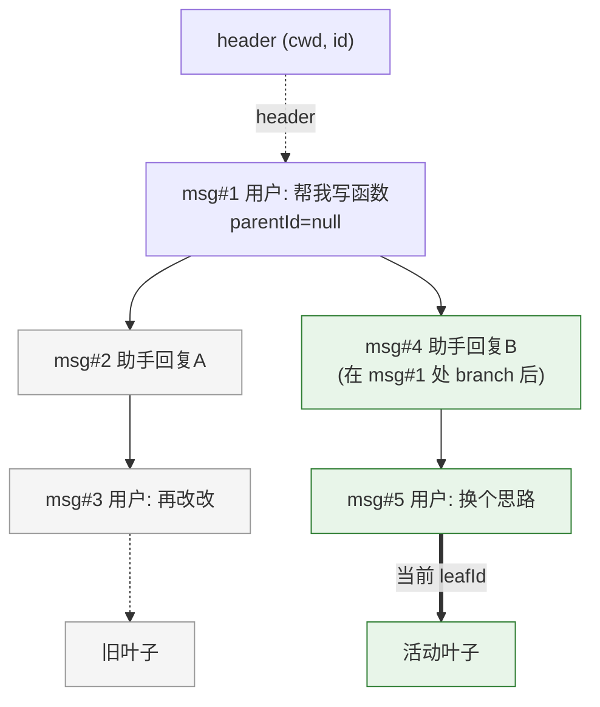
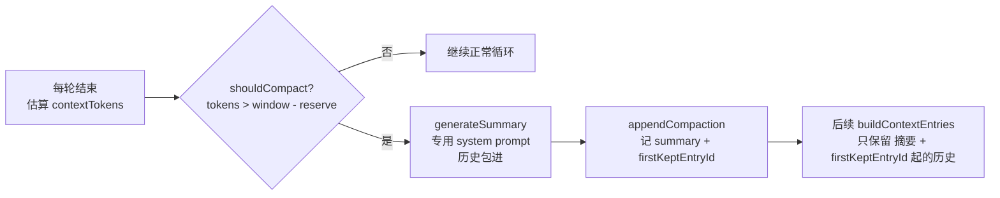

# 深入 04：会话树、上下文压缩与扩展系统

> 配套主文档《Pi Agent 源码研习知识库》第 4 部分。聚焦 coding-agent 三块"决定产品形态"的机制：
> **会话如何以树形 JSONL 持久化并支持分支、上下文如何压缩、扩展系统如何介入**。
> 符号名与行号对照仓库当前源码（`packages/coding-agent/src/core/` 下 `session-manager.ts`、`compaction/*`、`extensions/*`）。

## 目录

- [1. 会话存储：append-only JSONL 与九种 entry](#1-会话存储append-only-jsonl-与九种-entry)
- [2. 会话树：parentId 链接与分支](#2-会话树parentid-链接与分支)
- [3. buildSessionContext：从 entry 重建对话](#3-buildsessioncontext从-entry-重建对话)
- [4. 上下文压缩：触发条件与 generateSummary](#4-上下文压缩触发条件与-generatesummary)
- [5. 分支摘要：从被抛弃的分支保留上下文](#5-分支摘要从被抛弃的分支保留上下文)
- [6. 扩展系统：发现、加载与信任门](#6-扩展系统发现加载与信任门)
- [7. ExtensionRunner 与 ExtensionAPI：扩展能做什么](#7-extensionrunner-与-extensionapi扩展能做什么)

---

## 1. 会话存储：append-only JSONL 与九种 entry

`session-manager.ts` 的 `SessionManager`（`:855`）把整个会话持久化为一个 **JSONL 文件**（每行一个 JSON 对象，
`CURRENT_SESSION_VERSION = 3`，`:30`）。文件首行是 `SessionHeader`（`:32-39`，含 `cwd`、`id`、可选 `parentSession`），
其余每行是一个 `SessionEntry`。

`SessionEntry` 是九种类型的联合（`:144-153`）：

| entry 类型 | 定义行 | 作用 | 进入 LLM 上下文? |
| --- | --- | --- | --- |
| `SessionMessageEntry` (`"message"`) | :53 | 一条 `AgentMessage`（user/assistant/toolResult） | 是 |
| `ThinkingLevelChangeEntry` | :58 | 记录思考等级切换 | 否（元数据） |
| `ModelChangeEntry` | :63 | 记录模型切换（provider + modelId） | 否（元数据） |
| `CompactionEntry` | :69 | 压缩摘要 + `firstKeptEntryId` + `tokensBefore` | 是（作为摘要注入） |
| `BranchSummaryEntry` | :82 | 分支摘要（`fromId` + summary） | 是（作为摘要注入） |
| `CustomEntry` (`"custom"`) | :104 | 扩展私有状态 | 否 |
| `CustomMessageEntry` | :135 | 扩展注入的消息 | 是 |
| `LabelEntry` | :111 | 用户书签（给某 entry 打标签） | 否 |
| `SessionInfoEntry` | :118 | 会话元信息（如显示名） | 否 |

每个 entry 都有 `SessionEntryBase`（`:46-51`）：`id`（8 位 hex）、`parentId`、`timestamp`、`type`。

**append-only 的意义**：所有写操作只追加、从不修改已有行。这带来两个好处——崩溃安全（写一半最多丢最后一行）、
以及**天然支持分支**（见第 2 节）。所有 `appendXxx()` 方法（`appendMessage` `:1057`、`appendModelChange` `:1083`、
`appendThinkingLevelChange` `:1070`、`appendCompaction` `:1097`、`appendCustomEntry` `:1122` 等）都走
`_appendEntry`（`:1044`）：推入内存数组 → 更新 `byId` 索引 → 把 `leafId` 指向新 entry → 持久化。

这也解释了主文 `sdk.ts` 里为什么新会话要 `appendModelChange` + `appendThinkingLevelChange`（`sdk.ts:371-373`）：
把初始状态记进 JSONL，恢复会话时才能还原。

---

## 2. 会话树：parentId 链接与分支

会话不是一条线性列表，而是一棵**树**。机制很简单：每个 entry 有 `id` 和 `parentId`，首个 entry 的
`parentId` 为 `null`（根），后续 entry 的 `parentId` 指向前一个。`SessionManager` 维护一个 `leafId`（`:866`）
指向"当前所在的叶子"。追加时新 entry 的 `parentId = this.leafId`。

**分支怎么产生？** `branch(branchFromId)`（`:1360`）只做一件事：`this.leafId = branchFromId`——把叶子指针移回
某个更早的 entry。下一次 `append` 就会以那个 entry 为父创建新 entry，于是从该点**分叉**出一条新路径。
旧路径的 entry 一个没动（append-only）。



**重建活动路径** `getBranch(fromId?)`（`:1260`）：从 `fromId ?? leafId` 出发，沿 `parentId` 一路走到根，
再 `reverse()` 得到根→叶的有序路径。`getTree()`（`:1310`）则重建完整树（含所有分支）供 UI 的 fork 选择器展示。
`byId` 索引（`_buildIndex` `:958`）让这些 parent 查找是 O(1)。

主文 `AgentSession.navigateTree()`（`agent-session.ts:2895`）就是在这套结构上跳转：切到另一个 entry 作为叶子，
可选地为"离开的那条分支"生成摘要（见第 5 节）。

---

## 3. buildSessionContext：从 entry 重建对话

`buildSessionContext()`（`:461-470`）是"打开一个已有会话时，怎么把 JSONL 变回 `AgentMessage[]` + model + thinkingLevel"的入口，
被主文 `sdk.ts:188` 调用。三步：

1. **取活动路径**：`buildSessionPath(entries, leafId, byId)`（`:334`）得到根→叶序列。
2. **解析 model 与 thinkingLevel**：`getSessionContextSettings(path)`（`:362`）沿路径走，遇
   `thinking_level_change` 更新思考等级、遇 `model_change`（或从 assistant 消息的 provider/model）更新模型。
   默认 `thinkingLevel="off"`、`model=null`。
3. **构造上下文消息**：`buildContextEntries`（`:418`）**处理压缩**——若路径中有 `compaction` entry，
   就只保留"压缩 entry 本身 + 从 `firstKeptEntryId` 起的后续 entry"，丢弃被压缩掉的历史。然后
   `sessionEntryToContextMessages`（`:383`）把每个 entry 转成 LLM 消息：
   - `message` → 原样；
   - `custom_message` → `createCustomMessage`；
   - `branch_summary` → `createBranchSummaryMessage`（带 `<summary>` 包裹前后缀，见主文 `messages.ts`）；
   - `compaction` → `createCompactionSummaryMessage`；
   - 其它（label/model_change/…）→ `[]`（不进上下文）。

> 注意与 `core/messages.ts` 的 `convertToLlm` 的分工：`buildSessionContext` 负责**从存储重建
> `AgentMessage[]`**（含压缩裁剪）；`convertToLlm` 负责**每次请求前把 `AgentMessage[]` 转成 provider `Message[]`**
> （过滤 UI-only）。前者磁盘→内存，后者内存→provider。

---

## 4. 上下文压缩：触发条件与 generateSummary

上下文窗口有限，长会话会撑爆。压缩逻辑在 `compaction/compaction.ts`。

**触发判定** `shouldCompact(contextTokens, contextWindow, settings)`（`:235`）：

```ts
if (!settings.enabled) return false;
return contextTokens > contextWindow - settings.reserveTokens;
```

即 **当前上下文 token > 上下文窗口 − reserveTokens** 时触发。默认（`:132-136`）：
`reserveTokens: 16384`（给压缩摘要的响应留空间）、`keepRecentTokens: 20000`（压缩后保留多少最近历史）。

**生成摘要** `generateSummary()`（`:587`，`generateSummaryWithUsage` `:622`）：**再调一次 LLM**，但用专门的系统提示
`SUMMARIZATION_SYSTEM_PROMPT`（`utils.ts:156`），明确指示"你是上下文摘要助手……不要继续对话、不要回答其中的问题、
只输出结构化摘要"。待摘要的历史被 `serializeConversation()`（`:651`）序列化并包进 `<conversation>` 标签
（防止模型把它当成要接续的对话）。若已有旧摘要，则改用 `UPDATE_SUMMARIZATION_PROMPT`（`:500`）增量更新。

**保留 vs 替换**：截断点之前的历史被摘要并丢弃；由 `keepRecentTokens` 决定的最近消息原样保留。
`compact()`（`:817`）返回摘要字符串；真正写入由 `SessionManager.appendCompaction`（`session-manager.ts:1097`）
落成一个 `CompactionEntry`（记 `summary` + `firstKeptEntryId` + `tokensBefore`）。下次 `buildContextEntries`
就据此裁剪（第 3 节）。



主文 `AgentSession` 侧：`compact()`（`agent-session.ts:1783`，手动）与 `_runAutoCompaction()`（`:2047`，自动）
两条入口，`setAutoCompactionEnabled`（`:2220`）开关自动压缩。

---

## 5. 分支摘要：从被抛弃的分支保留上下文

当你从会话树的一条分支**导航离开**去到另一个节点（第 2 节的 `navigateTree`），那条被抛下的分支里可能有有用的上下文
（比如刚才试错学到的东西）。`compaction/branch-summarization.ts` 负责把它压成一段摘要带走。

- **收集要摘要的 entry** `collectEntriesForBranchSummary()`（`:108`）：从旧叶子 `oldLeafId` 往回走到与目标
  `targetId` 的公共祖先，收集这段将被"离开"的 entry。按 token 预算（`:230`）从新到旧累积。
- **生成** `generateBranchSummary()`（`:293`）：与压缩同样的模式——序列化、包 `<conversation>`、用
  `BRANCH_SUMMARY_PROMPT`（`:258`）调 LLM，结果前缀 `BRANCH_SUMMARY_PREAMBLE`（`:253`）。
- **落盘** `SessionManager.branchWithSummary()`（`session-manager.ts:1381`）：移动叶子 + 追加 `BranchSummaryEntry`。
  重建上下文时它经 `createBranchSummaryMessage` 变成一条带 `<summary>` 的 user 消息注入新分支。

一句话：**压缩**是"同一条线太长了，把前半段缩成摘要"；**分支摘要**是"要换到另一条线了，把这条线缩成摘要带过去"。
两者共用"专用 prompt + `<conversation>` 包裹 + 追加摘要 entry"的机制。

---

## 6. 扩展系统：发现、加载与信任门

扩展是 Pi 的可扩展性模型（主文 4.2）。`extensions/loader.ts` 负责发现与加载。

**发现**（`discoverAndLoadExtensions` `:678`，`discoverExtensionsInDir` `:641`）从三处来源：

1. 项目本地 `cwd/.pi/extensions/`（`:700`）；
2. 全局 `~/.pi/agent/extensions/`（`:704`）；
3. settings 里显式配置的（`:708`）。

目录里直接的 `.ts`/`.js` 文件会被加载；子目录则找 `index.ts`/`index.js` 或带 `"pi.extensions"` 字段的
`package.json`（`:662-666`），只下探一层。

**加载 TS 模块** `loadExtensionModule()`（`:405`）用 `jiti`（一个 TS 即时加载器，`:413`）。三种运行形态各有解析策略：
Bun 二进制用 `virtualModules`（`:418`，把 `@earendil-works/pi-agent-core`、`typebox` 等打包依赖虚拟提供，
扩展无需自带 `node_modules`）、源码 tsx 模式用 `tsconfigPaths`、Node 构建模式用 alias。

**信任门**：加载器本身不强制信任，它只负责语法检查与加载。项目信任在启动时由 `runner.ts:202` 的
`emitProjectTrustEvent()` 触发一个 `project_trust` 事件来把关（配合主文 3.3 的 `resolveProjectTrusted` /
`ProjectTrustStore`）。**未信任的项目，其项目本地扩展不会被执行**——因为扩展是可执行代码，`cd` 进陌生仓库时这是安全底线。

---

## 7. ExtensionRunner 与 ExtensionAPI：扩展能做什么

### ExtensionRunner（`runner.ts:267`）——事件总线

`AgentSession` 持有它（主文 `agent-session.ts:341`），用它把 agent 生命周期广播给所有扩展：

- `hasHandlers(type)`（`:568`）：是否有扩展登记了该事件的处理器（主文 `sdk.ts` 里 streamFn 就用它判断要不要跑
  header 钩子，避免无谓开销）。
- `emit(event)`（`:796`）：遍历扩展、取 `handlers.get(event.type)`、逐个调用。
- 一批专用发射器：`emitContext`（`:979`，LLM 请求前改上下文）、`emitBeforeProviderRequest`（`:1011`）、
  `emitBeforeProviderHeaders`（`:1045`）、`emitToolCall`/`emitToolResult`（`:927`/`:872`）、`emitUserBash`（`:950`）等。

**事件类型**（`types.ts:1034` 的 `ExtensionEvent` 联合）覆盖：会话（`session_start`/`session_shutdown`/
`session_before_fork`/`session_compact`…）、agent/LLM（`context`/`before_provider_request`/
`before_provider_headers`/`after_provider_response`/`turn_start`/`turn_end`/`message_*`）、
工具（`tool_execution_*`/`tool_call`/`tool_result`）、模型（`model_select`/`thinking_level_select`）、
用户（`user_bash`/`input`/`project_trust`/`resources_discover`）。

### ExtensionAPI（`types.ts:1185`）——扩展作者的 `pi.*` 门面

扩展工厂拿到的 `pi` 对象。主要能力分组：

| 分组 | 方法 | 行号 |
| --- | --- | --- |
| 事件订阅 | `on(event, handler)` | :1190 |
| 工具 | `registerTool(tool)` | :1238 |
| 命令/快捷键/CLI 标志 | `registerCommand` / `registerShortcut` / `registerFlag` / `getFlag` | :1247–1269 |
| 自定义渲染 | `registerMessageRenderer` / `registerEntryRenderer` | :1276–1279 |
| 动作 | `sendMessage` / `sendUserMessage` / `appendEntry` | :1286–1301 |
| 会话元信息 | `setSessionName` / `getSessionName` / `setLabel` / `exec` | :1308–1314 |
| 工具管理 | `getActiveTools` / `getAllTools` / `setActiveTools` / `getCommands` | :1320–1326 |
| 模型/思考 | `setModel` / `getThinkingLevel` / `setThinkingLevel` | :1336–1342 |
| Provider 注册 | `registerProvider` / `unregisterProvider` | :1400–1416 |
| 扩展间通信 | `events: EventBus` | :1419 |

一条清晰的因果链把这些串起来：扩展调 `pi.registerTool(...)` → 工具进 `extension.tools` Map → `AgentSession`
构建运行时时把它并入 `agent.state.tools` → Agent Loop 在 `executeToolCalls` 时能找到并执行它
（深入 01 第 5 节）。而 `pi.registerProvider(...)` 则通过 `ModelRuntime.registerProvider`（主文 3.2）
把新的 LLM 服务接进模型运行时。

> **扩展作者注意**：注册的处理器跑在 agent 事件序列中间，遵循与核心钩子相同的"不要抛出、返回安全值"契约
> （深入 01 第 8 节）。想改出网请求就用 `before_provider_headers`/`before_provider_request`；
> 想改进上下文就用 `context`（对应 `Agent.transformContext`）。

---

← 上一篇：[深入 03：TUI 差分渲染与终端输入](./deep-03-tui-diff-rendering.md) ·
返回主文档：[Pi Agent 源码研习知识库](./pi-agent-source-study.md)
