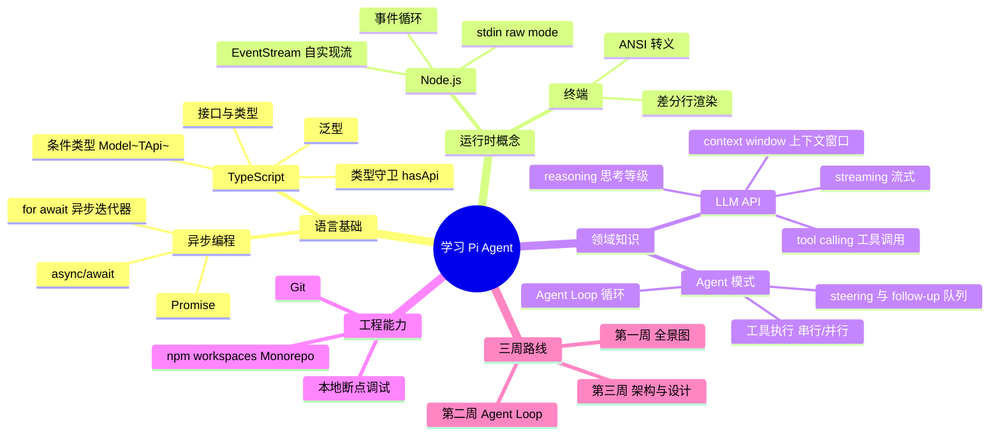
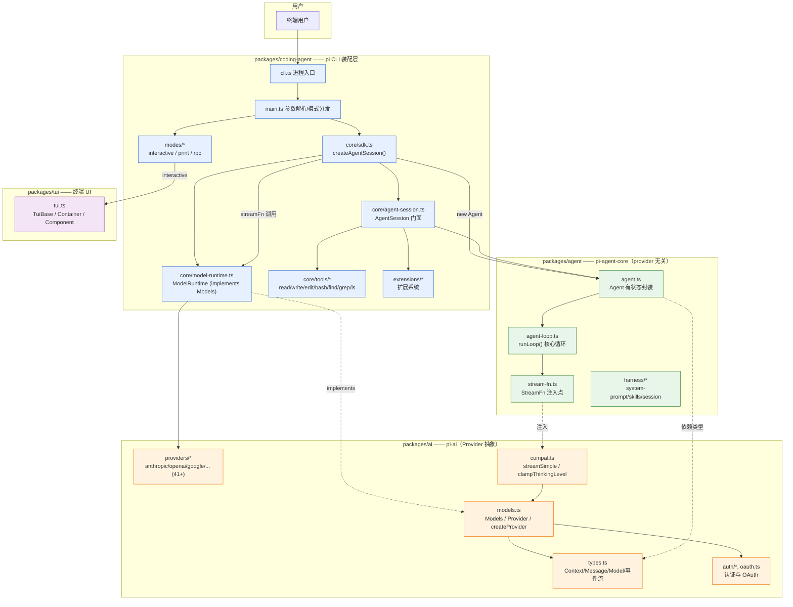
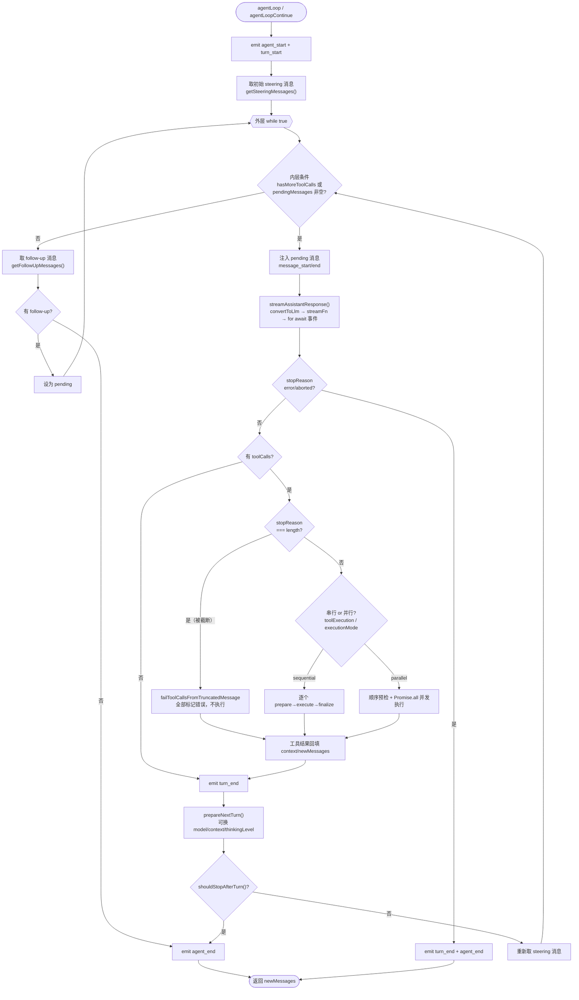
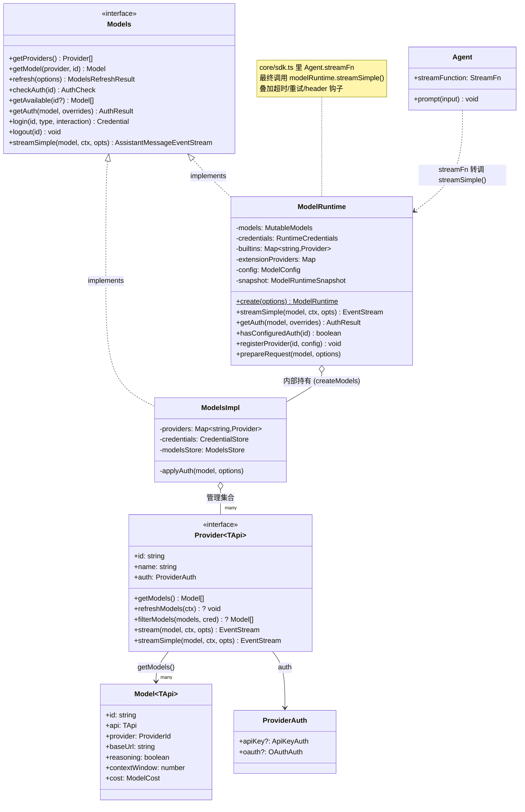
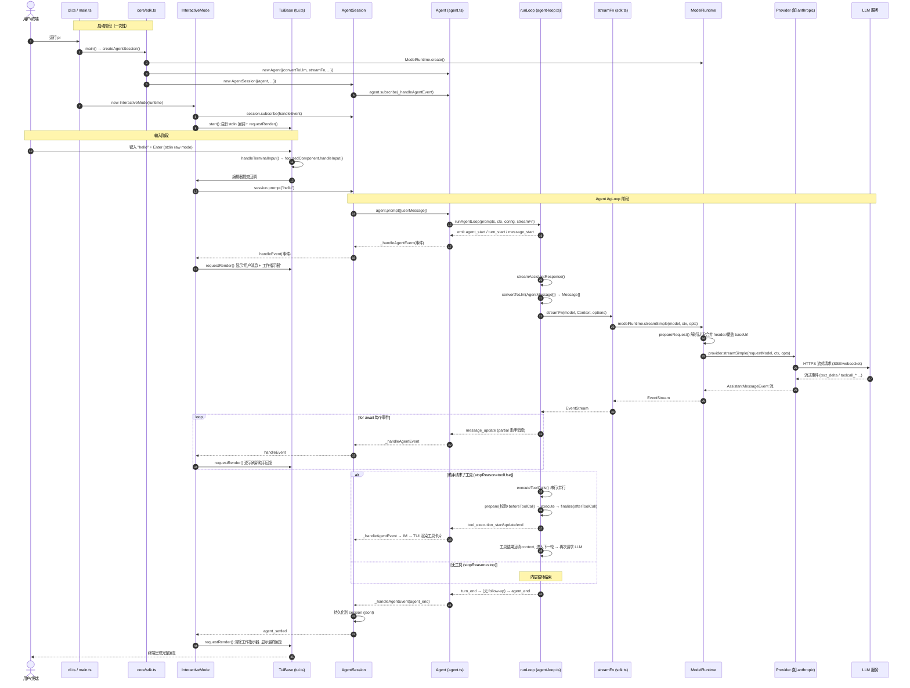
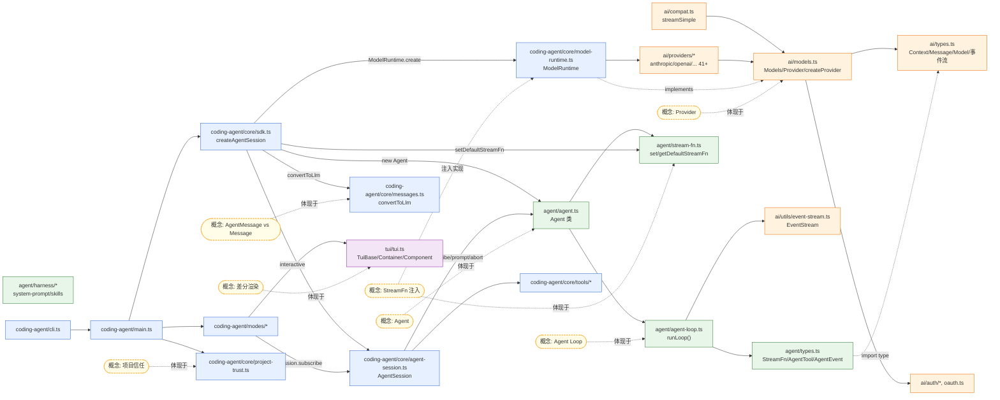

# Pi Agent 源码研习知识库

> **零基础入门 → 能改功能** 的系统化源码学习文档
>
> 面向"会写一点代码、但不一定了解 Agent"的读者。先理解一个小 Agent，再在遇到问题时补
> TypeScript、异步与终端知识。

---

## 关于版本的重要说明（先读这一条）

本文档中的**一切结论都对标当前仓库磁盘上的真实源码**，而非参考文档里写的版本号。经核对：

| 项目 | 参考文档所述 | 仓库真实值（本次核对） |
| --- | --- | --- |
| 版本号 | v0.80.10 | monorepo 根 `package.json` 为 `0.0.3`；各 workspace 包（ai/agent/coding-agent/tui/…）为 **`0.83.0`** |
| 仓库根 | `pi/` | `pi/` 子目录（`git` 根即此目录） |
| Node 引擎 | 22+ | `"node": ">=22.19.0"` |

> ⚠️ **避坑要点**：不要把参考文档里的版本号或"行数"当成事实来引用。行数会随迭代变化，参考文档自己也说"不要把行数当作阅读目标"。本文档给出的行号是**核对当下源码后的定位锚点**，用于帮你在编辑器里快速跳转，而非承诺永不变化。

---

## 目录

- [第 0 部分：前置知识与学习路径](#第-0-部分前置知识与学习路径)
  - [0.1 前置技能矩阵](#01-前置技能矩阵)
  - [0.2 必备理论补课（Agent / TS 异步 / Node 流）](#02-必备理论补课agent--ts-异步--node-流)
  - [0.3 只需先记住的几个词](#03-只需先记住的几个词)
  - [0.4 不同背景读者的学习侧重点](#04-不同背景读者的学习侧重点)
  - [0.5 调试环境清单](#05-调试环境清单)
  - [0.6 前置技能学习路径思维导图](#06-前置技能学习路径思维导图)
- [第 1 部分：全景搭建（第一周）](#第-1-部分全景搭建第一周)
  - [1.1 Monorepo 分层架构](#11-monorepo-分层架构)
  - [1.2 项目整体分层架构图](#12-项目整体分层架构图)
  - [1.3 仓库结构与"可跳过"文件](#13-仓库结构与可跳过文件)
  - [1.4 命令速查](#14-命令速查)
- [第 2 部分：Agent Loop 核心逻辑（第二周）](#第-2-部分agent-loop-核心逻辑第二周)
  - [2.1 数据结构地基：AgentMessage / Message / Context](#21-数据结构地基agentmessage--message--context)
  - [2.2 agent-loop.ts 逐段拆解](#22-agent-loopts-逐段拆解)
  - [2.3 Agent Loop 核心循环流程图](#23-agent-loop-核心循环流程图)
  - [2.4 agent.ts：有状态的 Agent 封装](#24-agentts有状态的-agent-封装)
  - [2.5 StreamFn 契约与依赖注入](#25-streamfn-契约与依赖注入)
- [第 3 部分：pi-ai 模型层 —— Provider 与 ModelRuntime](#第-3-部分pi-ai-模型层--provider-与-modelruntime)
  - [3.1 models.ts：Provider / Models 抽象](#31-modelstsprovider--models-抽象)
  - [3.2 ModelRuntime、Provider、LLM 模型服务关联类图](#32-modelruntimeproviderllm-模型服务关联类图)
  - [3.3 认证与项目信任](#33-认证与项目信任)
- [第 4 部分：coding-agent 装配层](#第-4-部分coding-agent-装配层)
  - [4.1 CLI 入口 → main.ts → createAgentSession](#41-cli-入口--maints--createagentsession)
  - [4.2 AgentSession：门面与服务编排](#42-agentsession门面与服务编排)
  - [4.3 工具（Tools）体系](#43-工具tools体系)
- [第 5 部分：TUI 差分渲染](#第-5-部分tui-差分渲染)
  - [5.1 Component 契约与容器树](#51-component-契约与容器树)
  - [5.2 输入分发与渲染调度](#52-输入分发与渲染调度)
- [第 6 部分：完整数据流 —— `pi hello` 发生了什么](#第-6-部分完整数据流--pi-hello-发生了什么)
  - [6.1 终端输入 → TUI 渲染 → LLM 会话 → 工具调用 完整时序图](#61-终端输入--tui-渲染--llm-会话--工具调用-完整时序图)
  - [6.2 全链路文字讲解](#62-全链路文字讲解)
- [第 7 部分：项目知识图谱](#第-7-部分项目知识图谱)
- [第 8 部分：深入专题（配套扩展文档）](#第-8-部分深入专题配套扩展文档)
- [附录 A：三周阅读路线表](#附录-a三周阅读路线表)
- [附录 B：术语表](#附录-b术语表)

> 📚 **配套深入专题**：主文覆盖全景与主流程；以下四篇独立文档深挖重点模块的疑难机制，读完对应章节后再看能事半功倍。
> 详见 [第 8 部分](#第-8-部分深入专题配套扩展文档)。
> - [深入 01：Agent Loop 与事件流内核](./deep-01-agent-loop-internals.md)
> - [深入 02：pi-ai Provider / 认证 / 流式](./deep-02-pi-ai-provider-auth.md)
> - [深入 03：TUI 差分渲染与终端输入](./deep-03-tui-diff-rendering.md)
> - [深入 04：会话树、上下文压缩与扩展系统](./deep-04-session-compaction-extensions.md)

---

# 第 0 部分：前置知识与学习路径

最重要的前置知识只有三个：

1. 能读懂基本的 TypeScript / JavaScript；
2. 知道 `async/await` 大概在做什么；
3. 愿意在本地运行代码，并观察一次输入是怎样流动的。

其余概念会在文中边用边解释。

## 0.1 前置技能矩阵

| 技能 | 重要程度 | 为什么需要 | 学习资源 |
| --- | --- | --- | --- |
| **TypeScript** | ⭐⭐⭐⭐⭐ | 整个项目 100% TS，大量使用泛型、类型守卫、接口、条件类型（如 `Model<TApi>` 的 `compat` 条件类型） | [TypeScript 手册](https://www.typescriptlang.org/docs/) |
| **async/await 与 Promise** | ⭐⭐⭐⭐⭐ | Agent Loop 完全异步；流式处理基于 `async iterator`（`for await...of`） | 同上 |
| **Node.js 事件与 Stream** | ⭐⭐⭐⭐ | TUI 读取 stdin 流、LLM 响应是事件流、`EventStream` 自实现异步迭代器 | [Node.js Stream 文档](https://nodejs.org/api/stream.html) |
| **LLM API 概念** | ⭐⭐⭐⭐ | 理解 streaming、tool calling、context window、reasoning | [OpenAI API 文档](https://platform.openai.com/docs) |
| **Git** | ⭐⭐⭐ | 克隆仓库、切换分支、查看 diff | [Pro Git](https://git-scm.com/book) |
| **npm / Monorepo** | ⭐⭐ | workspaces 管理多包依赖 | [npm workspaces](https://docs.npmjs.com/cli/using-npm/workspaces) |
| **终端基础** | ⭐⭐ | ANSI 转义码、raw mode、stdin/stdout | 本文档第 5 部分会解释 |

**不需要的前置**：React / Vue / Web 框架、数据库、Docker。本项目是纯 Node.js 终端应用。

## 0.2 必备理论补课（Agent / TS 异步 / Node 流）

这一节补齐"入门门槛"，读懂后再进源码会轻松很多。

### (1) 什么是 Agent？与"请求→响应"有何不同

传统 API 调用是**一问一答**：发请求 → 拿响应 → 结束。

**Agent = LLM + 工具 + 循环**。模型不仅回答，还能"请求执行工具"（读文件、跑命令、编辑代码），
系统执行工具后把结果**回填**给模型，模型据此**继续**行动，直到它认为任务完成、不再请求工具为止。
这个"请求模型 → 执行工具 → 回填结果 → 再请求模型"的重复过程就是 **Agent Loop**。

在 Pi 中它落地为 `packages/agent/src/agent-loop.ts` 的 `runLoop()` 函数。

### (2) TypeScript 异步：Promise、async/await、async iterator

- `Promise<T>`：一个"将来会有 T 值"的容器。
- `async function`：函数体内可用 `await` 等待 Promise；函数本身返回 `Promise`。
- **`for await (const x of stream)`**：异步迭代器。每次循环 `await` 拿到流里的**下一个事件**，直到流结束。
  Pi 的 LLM 响应就是这样被逐块消费的（见 `agent-loop.ts:317` 的
  `for await (const event of response)`）。

一个最小心智模型：

```ts
// LLM 返回的是"事件流"，不是一次性字符串。
for await (const event of response) {
  if (event.type === "text_delta") process.stdout.write(event.delta); // 逐字打印
  if (event.type === "done") break;                                    // 结束
}
```

### (3) Node 流与自实现的 EventStream

Pi 没有直接用 Node 的 `stream.Readable`，而是自实现了一个通用异步事件流
`EventStream<T, R>`（`packages/ai/src/utils/event-stream.ts:4`）。它做两件事：

- 实现 `AsyncIterable<T>`：可以 `for await` 消费事件（`push(event)` 入队，消费者取走）；
- 维护一个 `finalResultPromise`：当某个事件满足 `isComplete()` 时，用 `extractResult()`
  把它转成"最终结果 `R`"，供 `.result()` 一次性 `await`。

Agent 层就是用它把"零散的流事件"和"最终 `AgentMessage[]` 结果"统一起来的
（`agent-loop.ts:145` 的 `createAgentStream()`）。

### (4) TypeScript 严格约束（读代码时会遇到）

项目在 **Node strip-only / erasable-syntax** 模式下检查，因此源码里**不会**出现：
`enum`、`namespace`/`module`、参数属性（constructor 里直接 `private x`）、`import =`/`export =`。
类字段一律显式声明 + 构造函数里赋值。类型检查用 `tsgo`，格式化/lint 用 Biome。
（来源：仓库 `AGENTS.md` "Code Quality" 与 `CLAUDE.md` "TypeScript constraints"。）

## 0.3 只需先记住的几个词

当前 Pi 的 LLM 层由两层组成：先理解 `pi-ai` 的通用能力，再理解 `coding-agent` 如何用
`ModelRuntime` 把它们组合起来。

| 概念 | 一句话解释 | 源码锚点 |
| --- | --- | --- |
| **Agent** | 能调用工具、根据结果继续行动的模型应用 | `packages/agent/src/agent.ts` |
| **Agent Loop** | "请求模型 → 执行工具 → 回填结果"的循环 | `agent-loop.ts` 的 `runLoop()` |
| **Provider** | 一家模型服务的连接方式、模型目录和认证规则 | `models.ts` 的 `Provider` 接口 |
| **Models** | 一组 Provider 的运行时集合，负责解析认证并把请求转发给对应 Provider | `models.ts` 的 `Models` 接口 |
| **ModelRuntime** | coding-agent 用来组合模型、配置、凭证的门面（实现 `Models`） | `core/model-runtime.ts` |
| **StreamFn** | 注入给 Agent Loop 的"发起一次 LLM 流式请求"的函数 | `agent/src/types.ts` 的 `StreamFn` |
| **AgentSession** | coding-agent 的会话门面，编排 Agent、工具、扩展、会话存储 | `core/agent-session.ts` |
| **项目信任** | 加载项目扩展前，先确认是否允许它们运行 | `core/project-trust.ts`、`cli/project-trust.ts` |

## 0.4 不同背景读者的学习侧重点

### 如果你是前端开发者

需要补：
1. **Node.js Stream / 异步迭代器** —— TUI 与 LLM 通信都基于"流"；
2. **终端概念** —— raw mode、ANSI 转义（第 5 部分）；
3. **Agent 模式** —— 思考"LLM + 工具 + 循环"而非"请求→响应"。

你的优势：`Component` 接口（`tui.ts:23`）与 React 组件思想相通——都有 `render()` 与
"失效重渲"（`invalidate()`）。

### 如果你是后端开发者

需要补：
1. **LLM API** —— streaming、tool calling、reasoning；
2. **终端 UI** —— 与 Web UI 不同的渲染模型（差分行渲染）；
3. **TS 类型系统** —— 项目重度使用泛型/条件类型（如 `Model<TApi>`）。

你的优势：事件循环、异步编程、API 抽象（`Provider`/`Models` 就是标准的"接口 + 实现 + 集合"）。

### 如果你是 Python / 非 TS 开发者

建议先花 1–2 天补 TS：类型注解、接口、泛型、`async/await`、ES Module 导入导出。
Pi 代码风格是**显式类型、尽量避免 `any`、纯 async/await**，对 Python 开发者相当易读。

## 0.5 调试环境清单

| 工具 | 用途 | 安装 |
| --- | --- | --- |
| **VS Code** | 断点调试、代码导航 | 推荐 |
| **Node.js 22.19+** | 运行环境（`package.json` 要求 `>=22.19.0`） | `nvm install 22` |
| **npm** | workspaces 包管理 | 随 Node 安装 |
| **tsx** | 直接运行 TS 源码（`pi-test.sh` 用它） | 项目 devDependencies 已含 `tsx@4.22.1` |
| **tmux** | 在受控终端里测 TUI（见 `AGENTS.md`） | 系统包管理器 |

本仓库提供的现成脚本（来自 `CLAUDE.md` / `package.json`）：

```bash
npm install --ignore-scripts   # 安装依赖，不跑生命周期脚本（依赖安全，见 AGENTS.md）
npm run check                  # biome + 各类检查 + tsgo 类型检查（不跑测试）
./test.sh                      # 在隔离 HOME、无 API key 环境跑测试（跳过 e2e/LLM）
./pi-test.sh                   # 用 tsx 从源码直接运行 pi（保留当前 cwd）
./pi-test.sh --no-env          # 同上，但清空所有 provider API key
```

> **不要在浏览器里读代码**。本项目要靠本地断点调试追踪运行时数据流；GitHub 网页无法追踪运行行为。
> **不要**擅自运行 `npm run build` / `npm test`（见 `AGENTS.md`）。

## 0.6 前置技能学习路径思维导图



---

# 第 1 部分：全景搭建（第一周）

**本周目标**：能回答"我在终端输入 `pi hello`，发生了什么？"

## 1.1 Monorepo 分层架构

系统按层组织，**每一层只依赖它上方的层**。核心心智模型是这条依赖箭头：

> **coding-agent → agent → ai**，其中 **tui** 被 coding-agent 用于渲染。

| 包 | npm 名 | 职责 | 关键文件 |
| --- | --- | --- | --- |
| `packages/ai` | `@earendil-works/pi-ai` | Provider 抽象、统一 LLM API、认证/OAuth、模型目录 | `models.ts`、`types.ts`、`providers/*` |
| `packages/agent` | `@earendil-works/pi-agent-core` | **provider 无关**的 Agent 运行时（Agent Loop + Harness） | `agent-loop.ts`、`agent.ts`、`types.ts` |
| `packages/coding-agent` | `@earendil-works/pi-coding-agent` | 用户可见的 `pi` CLI（装配层） | `main.ts`、`core/sdk.ts`、`core/agent-session.ts`、`core/model-runtime.ts` |
| `packages/tui` | `@earendil-works/pi-tui` | 差分渲染终端 UI 库 | `tui.ts` |
| 其它 | `pi-server`（实验）、`pi-evals`、`storage/*` | 服务端 / 评测 / 存储 | — |

**关键设计原则**：`packages/agent` 不 import `pi-ai/compat`。发起 LLM 请求的能力通过
`StreamFn` **注入**（依赖倒置），使 Agent 运行时保持 provider 无关。这一点在
`agent/src/stream-fn.ts`（`setDefaultStreamFn` / `getDefaultStreamFn`）和
`coding-agent/src/core/sdk.ts:36`（`setDefaultStreamFn(streamSimple)`）中可见。

## 1.2 项目整体分层架构图



## 1.3 仓库结构与"可跳过"文件

**好消息**：你不需要读完所有代码。沿运行时边界阅读，核心逻辑会自然收敛到几组文件：

- `packages/agent/src/agent-loop.ts` —— Agent Loop 核心（本次核对约 792 行）
- `packages/agent/src/agent.ts` —— 有状态 `Agent` 封装（约 577 行）
- `packages/coding-agent/src/core/agent-session.ts` —— 会话门面（约 3332 行，庞大，可分段读）
- `packages/coding-agent/src/core/sdk.ts` —— `createAgentSession` 装配入口（约 398 行）
- `packages/coding-agent/src/core/model-runtime.ts` —— `ModelRuntime`（约 595 行）
- `packages/ai/src/models.ts` —— Models 运行时核心（约 705 行）
- `packages/tui/src/tui.ts` —— TUI 差分渲染核心（约 1208 行）

**初读可跳过的冗余/生成类文件**（避坑要点）：

| 可跳过 | 位置 | 原因 |
| --- | --- | --- |
| 按 Provider 生成的模型目录 | `packages/ai/src/providers/*.models.ts` | 构建产物，机器生成 |
| 生成的模型数据 | `packages/ai/src/models.generated.ts`、`image-models.generated.ts` | 构建产物；**永远不要手改**，改 `scripts/generate-models.ts` 后重新生成 |
| 各 Provider 的 API 实现 | `packages/ai/src/api/*.ts` | 40+ 家 provider 的适配细节，用到再看 |
| 各 Provider 定义 | `packages/ai/src/providers/*.ts`（41+ 个） | 先读 `anthropic.ts` 一个即可，其余同构 |
| 测试与示例扩展 | `**/*.test.ts`、`examples/extensions/*` | 理解主流程时不必读 |

> **避坑**：`packages/ai/src/providers/` 下 `.ts` 与 `.models.ts` 成对出现。`<provider>.ts` 是逻辑，
> `<provider>.models.ts` 是生成的目录数据——**只读前者**。

## 1.4 命令速查

```bash
npm install --ignore-scripts   # 安装依赖（不跑生命周期脚本）
npm run check                  # lint + 格式 + pinned-dep/import/shrinkwrap 检查 + tsgo 类型检查
./test.sh                      # 隔离环境跑非 e2e 测试（首选测试器）
./pi-test.sh                   # tsx 从源码运行 pi
npm run build                  # 刷新模型数据后按依赖顺序构建全部包
npm run build:offline          # 用已有模型数据构建，不联网
```

单独跑一个测试（在包根目录，例如 `packages/coding-agent`）：

```bash
node ../../node_modules/vitest/dist/cli.js --run test/specific.test.ts
```

> 绝不直接跑裸 `vitest` 或 `npm test`：当环境里存在 endpoint/auth 变量时会激活 e2e 测试。

---

# 第 2 部分：Agent Loop 核心逻辑（第二周）

**本周目标**：能回答"LLM 如何调用工具、循环处理、最终给出答案？"

## 2.1 数据结构地基：AgentMessage / Message / Context

在读循环之前，先弄清三组类型，否则会晕。

### pi-ai 的"provider 消息" `Message`（`ai/src/types.ts:433`）

```ts
export type Message = UserMessage | AssistantMessage | ToolResultMessage;
```

- `UserMessage`（:393）：`role: "user"`，`content` 是字符串或 `(TextContent | ImageContent)[]`。
- `AssistantMessage`（:399）：`role: "assistant"`，`content` 是
  `(TextContent | ThinkingContent | ToolCall)[]`，并带 `usage`、**`stopReason`**、`errorMessage`。
- `ToolResultMessage`（:415）：`role: "toolResult"`，携带 `toolCallId` / `toolName` / `content` /
  `isError`。

`StopReason`（:391）取值：`"pending" | "stop" | "length" | "toolUse" | "error" | "aborted"`——
这是循环判断"该继续还是该停"的关键信号。

`Context`（`ai/src/types.ts:487`）就是一次 LLM 请求的三件套：

```ts
export interface Context {
  systemPrompt?: string;
  messages: Message[];
  tools?: Tool[];
}
```

### pi-agent-core 的"应用消息" `AgentMessage`（`agent/src/types.ts:319`）

```ts
export type AgentMessage = Message | CustomAgentMessages[keyof CustomAgentMessages];
```

关键设计：`CustomAgentMessages`（:310）是一个**空接口**，应用通过**声明合并**往里加自定义消息类型。
coding-agent 就在 `core/messages.ts:70` 用
`declare module "@earendil-works/pi-agent-core"` 加进了
`bashExecution` / `custom` / `branchSummary` / `compactionSummary` 四种。

因此，**Agent Loop 内部一直用 `AgentMessage`，只在真正调用 LLM 的边界，才通过
`convertToLlm(messages) => Message[]` 转换成 provider 认识的 `Message[]`**——UI-only 的消息在这一步被过滤掉。
（`agent/src/types.ts:173` 的 `convertToLlm` 契约；coding-agent 的实现在 `core/messages.ts:148`。）

### 事件流事件 `AssistantMessageEvent`（`ai/src/types.ts:501`）

一次流式响应会依次产生：`start` → `text_start/text_delta/text_end`、
`thinking_*`、`toolcall_*` → 终止事件 `done`（成功）或 `error`（失败/中止）。
每个事件都带一个 `partial: AssistantMessage`，即"到目前为止拼好的助手消息"。

## 2.2 agent-loop.ts 逐段拆解

`packages/agent/src/agent-loop.ts` 是整个系统的心脏。它的注释开宗明义：
"Agent loop that works with AgentMessage throughout. Transforms to Message[] only at the LLM call boundary."

### 入口：两个公开函数

- `agentLoop(prompts, context, config, signal, streamFn)`（:31）：**带新提示**启动。内部创建一个
  `EventStream<AgentEvent, AgentMessage[]>`，异步跑 `runAgentLoop`，结束时 `stream.end(messages)`。
- `agentLoopContinue(context, config, signal, streamFn)`（:64）：**不加新消息**、从当前 context 继续
  （用于重试）。**约束**：context 最后一条消息不能是 `assistant`（:74 会抛错），因为 LLM 需要以
  user / toolResult 结尾。

`createAgentStream()`（:145）定义了"何时算完成"：当事件是 `agent_end` 时，用其 `messages` 作为最终结果。

### 核心：`runLoop()`（:155）—— 双层循环

这是最需要理解的函数。它有**内外两层 while**：

```
外层 while(true)          // 处理"本该停下、但又来了 follow-up 消息"的情况
  内层 while(hasMoreToolCalls || pendingMessages.length > 0)
     1. 注入 pendingMessages（steering 消息）
     2. streamAssistantResponse() 流式拿助手回复
     3. 若 stopReason 是 error/aborted → 发 agent_end 直接返回
     4. 过滤出 toolCalls
        - 若 stopReason === "length"（被 token 上限截断）→ 全部标记失败（不执行）
        - 否则 executeToolCalls() 执行
     5. 把工具结果回填进 context 和 newMessages
     6. 发 turn_end
     7. prepareNextTurn?() → 可换 model / context / thinkingLevel
     8. shouldStopAfterTurn?() → 为真则 agent_end 返回
     9. 重新取 steering 消息
  内层结束后 → getFollowUpMessages?()；有则设为 pending 并 continue 外层，否则 break
发 agent_end
```

逐条对应源码（行号为当下定位锚点）：

| 步骤 | 行号 | 说明 |
| --- | --- | --- |
| 取初始 steering 消息 | :167 | `config.getSteeringMessages?.()` |
| 注入 pending 消息 | :182–190 | 发 `message_start`/`message_end`，压入 `currentContext` 和 `newMessages` |
| 流式助手响应 | :193 | `streamAssistantResponse(...)` |
| error/aborted 提前退出 | :196–200 | 发 `turn_end` + `agent_end` 返回 |
| 截断保护 | :211–213 | `stopReason === "length"` → `failToolCallsFromTruncatedMessage` |
| 正常执行工具 | :214 | `executeToolCalls(...)` |
| 回填工具结果 | :218–221 | push 进 context / newMessages |
| 换 model/context | :232–245 | `prepareNextTurn?.()` 返回快照后应用 |
| 优雅停止 | :247–257 | `shouldStopAfterTurn?.()` |
| follow-up | :263–268 | 本该停时再取 follow-up，有则继续外层 |

> **为什么要两层？** 内层处理"一次 agent 运行中的多轮工具调用 + 中途插入的 steering 消息"；
> 外层处理"agent 已经打算收工，但用户/扩展又排队了 follow-up 消息，需要重新开工"。
> `steering`（打断/引导）与 `follow-up`（等它干完再说）的区别正是这套队列语义（见 2.4）。

### 流式响应：`streamAssistantResponse()`（:281）

这是 **AgentMessage[] → Message[] 的唯一转换点**：

1. 可选 `transformContext()`（:290）在 AgentMessage 层做上下文裁剪/注入；
2. `config.convertToLlm(messages)`（:295）转成 `Message[]`；
3. 组装 `llmContext: Context`（:298）= systemPrompt + messages + tools；
4. **动态解析 API key**（:305）—— 对会过期的 OAuth token 很重要；
5. 调用注入的 `streamFunction(model, llmContext, options)`（:308）拿到事件流；
6. `for await` 消费事件（:317）：
   - `start`：把 partial 助手消息压入 context，发 `message_start`；
   - 各种 `*_delta`：更新 context 末尾的 partial，发 `message_update`；
   - `done`/`error`：`await response.result()` 拿最终消息，替换/追加，发 `message_end` 返回。

### 工具执行：串行 vs 并行

`executeToolCalls()`（:411）先判断模式：只要 `config.toolExecution === "sequential"`**或**任一被调用工具的
`executionMode === "sequential"`（:419），就走串行，否则并行。

- **串行** `executeToolCallsSequential`（:433）：逐个 `prepareToolCall` → `executePreparedToolCall` →
  `finalizeExecutedToolCall`，每个完整跑完再下一个；`signal.aborted` 时 break。
- **并行** `executeToolCallsParallel`（:489）：**先顺序预检**（准备参数、跑 `beforeToolCall` 钩子），
  再用 `Promise.all` 并发执行允许的工具（:540）；`tool_execution_end` 按**完成顺序**发，
  而工具结果消息按**助手消息里的原始顺序**发（:543–548）。

三个关键子步骤：

- `prepareToolCall`（:600）：找到工具 → `prepareArguments` 兼容 → `validateToolArguments` 校验 →
  跑 `beforeToolCall` 钩子（可 `{block:true}` 拦截）。任何异常都转成 `immediate` 错误结果，不抛出。
- `executePreparedToolCall`（:666）：调 `tool.execute(id, args, signal, onUpdate)`；`onUpdate` 回调
  会发 `tool_execution_update` 事件（流式工具进度）。
- `finalizeExecutedToolCall`（:709）：跑 `afterToolCall` 钩子，按字段合并覆盖
  content/details/usage/terminate/isError。

**提前终止**：`shouldTerminateToolBatch`（:582）—— 只有当本批**每一个**工具结果都 `terminate === true`
时才终止后续循环。

## 2.3 Agent Loop 核心循环流程图



## 2.4 agent.ts：有状态的 Agent 封装

`agent-loop.ts` 是**无状态**的纯循环；`packages/agent/src/agent.ts` 的 `Agent` 类（:171）在它之上加了
**状态、事件订阅、队列**，是 coding-agent 实际使用的对象。

它持有：

- `_state: MutableAgentState`（:172）—— `systemPrompt` / `model` / `thinkingLevel` / `tools` /
  `messages` / `isStreaming` / `pendingToolCalls` / `errorMessage`。`tools` 和 `messages` 用
  accessor，赋值时会**复制顶层数组**（:77–88）。
- 两个队列 `steeringQueue` / `followUpQueue`（`PendingMessageQueue`，:123），模式为 `"all"` 或
  `"one-at-a-time"`（:50 `QueueMode`）。
- 各种注入回调：`convertToLlm`（默认只保留 user/assistant/toolResult，:32）、`transformContext`、
  `streamFunction`、`getApiKey`、`beforeToolCall`、`afterToolCall`、`prepareNextTurn(WithContext)`。

关键方法：

| 方法 | 行号 | 作用 |
| --- | --- | --- |
| `subscribe(listener)` | :243 | 订阅生命周期事件；listener 按订阅顺序被 `await`，纳入本次运行的结算 |
| `prompt(input, images?)` | :337 | 起一个新提示；已有活动运行则抛错（要用 `steer`/`followUp`） |
| `continue()` | :350 | 从当前 transcript 继续；末条是 assistant 时先排空 steering/followUp |
| `steer(message)` | :276 | 入队"引导"消息 |
| `followUp(message)` | :281 | 入队"收工后再处理"的消息 |
| `abort()` | :312 | 中止当前运行的 `AbortController` |
| `waitForIdle()` | :321 | 等待当前运行 + 所有 `agent_end` 监听器结算 |
| `reset()` | :326 | 清空 transcript / 运行态 / 队列 |

`createLoopConfig()`（:434）把这些实例字段打包成 `AgentLoopConfig` 传给 `runAgentLoop`；
`processEvents()`（:529）在每个事件上先更新内部状态（如把 partial 存进 `streamingMessage`、
`message_end` 时 push 进 `messages`），再依次 `await` 所有 listener。
运行失败由 `handleRunFailure()`（:496）兜底：造一条 `stopReason: "aborted"/"error"` 的助手消息，
走正常事件序列，保证 UI 收到闭环。

## 2.5 StreamFn 契约与依赖注入

`StreamFn`（`agent/src/types.ts:28`）是理解"provider 无关"的钥匙：

```ts
export type StreamFn = (
  model: Model<Api>,
  context: Context,
  options?: SimpleStreamOptions,
) => AssistantMessageEventStream | Promise<AssistantMessageEventStream>;
```

**契约（务必记住）**：一旦被调用，**不得为请求/模型/运行时失败抛异常或返回 rejected promise**。
失败必须**编码进返回的事件流**——以一个 `stopReason` 为 `"error"` / `"aborted"` 且带 `errorMessage`
的最终 `AssistantMessage` 结束。这就是为什么 `runLoop` 里对 `stopReason` 的检查（:196）就足以处理所有失败。

注入路径有两条：

1. **默认兜底**：`stream-fn.ts` 的 `setDefaultStreamFn` / `getDefaultStreamFn`。
   coding-agent 在 `core/sdk.ts:36` 调 `setDefaultStreamFn(streamSimple)`，为那些不显式传
   `streamFn` 的老式扩展保留兼容。
2. **显式注入**：`core/sdk.ts:302` 构造 `Agent` 时传入一个 `streamFn`，其内部转调
   `modelRuntime.streamSimple(...)`，并叠加超时、重试、provider attribution header、扩展 header 钩子。

因为 Agent 层只依赖 `Model`/`Context`/`Message` 这些**类型**（`import type`），实际发请求的实现被完全隔离在
外层，`packages/agent` 就不必依赖任何 provider SDK 或 `pi-ai/compat`。

> 🔍 **深入阅读**：`EventStream` 的异步迭代器机制、双层循环里 steering/follow-up 的精确读取时点、
> 截断保护、并行工具的两种顺序、`terminate` 全票语义、以及"错误不抛出"的三道防线，见
> [深入 01：Agent Loop 与事件流内核](./deep-01-agent-loop-internals.md)。

---

# 第 3 部分：pi-ai 模型层 —— Provider 与 ModelRuntime

**本周目标**：能回答"认证和模型解析怎么发生？"

## 3.1 models.ts：Provider / Models 抽象

`packages/ai/src/models.ts` 定义了三个核心抽象：

### `Provider<TApi>`（:75）—— 一家模型服务

一个 Provider 拥有 `id` / `name` / 可选 `baseUrl` / `headers` / **`auth: ProviderAuth`**，以及：

- `getModels()`（:97）：同步返回当前已知模型（静态 provider 返回目录；动态 provider 返回上次
  `refreshModels()` 的结果）。**不得抛异常**——Models 把抛错的实现当作"没有模型"。
- `refreshModels(ctx)`（:104）：仅动态 provider；用凭证拉取更新的模型列表，失败时保留旧列表。
- `filterModels(models, credential)`（:111）：按凭证过滤模型可用性。
- `stream(...)` / `streamSimple(...)`（:113/:119）：真正发起请求。

### `Models`（:127）—— Provider 集合 + 认证应用

`Models` 持有多个 Provider，**自己解析认证**，然后把请求委派给拥有该模型的 Provider。关键方法：

- `getProviders()` / `getProvider(id)` / `getModels(provider?)` / `getModel(provider, id)`；
- `refresh(options)`（:147）：并发刷新所有已配置的动态 provider，错误与取消**不 reject**，收集进
  `ModelsRefreshResult.errors`；
- `checkAuth(providerId)`（:150）/ `getAvailable(providerId?)`（:153）：检查认证 / 返回认证完整的模型；
- `getAuth(...)`（:164）：解析 provider 认证；token 刷新失败抛 `ModelsError("oauth")`，
  api-key 失败抛 `ModelsError("auth")`；
- `login` / `logout`（:168/:171）；
- `stream` / `complete` / `streamSimple` / `completeSimple`（:173–186）。

`ModelsImpl`（:218）是实现类。`applyAuth()`（:463）是请求前的关键私有方法：解析认证 → 合并 header →
应用 `transformHeaders` → 若认证给了 `baseUrl` 则覆盖到请求 model 上，产出 `requestModel` + `requestOptions`。
`streamSimple()`（:512）用 `lazyStream(model, async () => ...)` 包装，做到"真正被消费时才解析认证并发请求"。

### `createProvider()`（:556）—— 从零件组装 Provider

内置 provider 工厂和 `models.json` 自定义 provider 都走这里。它维护 `baselineModels`（静态）+
`dynamicModels`（动态覆盖），`currentModels()`（:561）按 id 合并；`api` 可以是单个 `ProviderStreams`
或按 `model.api` 分发的 map（:570–574）。

几个实用工具函数：

- `hasApi(model, api)`（:635）：运行时类型守卫，把 `Model<Api>` 收窄成 `Model<具体Api>`。
- `calculateCost(model, usage)`（:639）：按分层价率算成本（含 Anthropic 1h 缓存写 2× 的特例）。
- `getSupportedThinkingLevels` / `clampThinkingLevel`（:663/:674）：思考等级能力探测与就近夹取。

## 3.2 ModelRuntime、Provider、LLM 模型服务关联类图

`coding-agent` 的 `ModelRuntime`（`core/model-runtime.ts:96`）**实现了 `Models` 接口**，是把内置 provider
目录、`models.json` 配置、扩展注册的 provider、运行时凭证全部组合起来的门面。



`ModelRuntime` 的要点（对照源码）：

- `ModelRuntime.create()`（:135）：加载凭证（`RuntimeCredentials`）、`ModelConfig`、`ModelsStore`，
  拿内置 provider 目录 `builtinProviders()`，用 `withRemoteCatalog` 包一层远程目录，构造实例后
  `refresh()`（可选联网，默认受 `PI_OFFLINE` 环境变量与 `allowModelNetwork` 控制）。
- provider 有三个来源层叠：`builtins`（内置）、`nativeExtensionProviders`（扩展直接给的 Provider 对象）、
  `extensionProviders`（扩展给的配置，需 compose）。`recomposeProvider()`（:202）负责把它们组合成最终 provider。
- `prepareRequest()`（:440）：请求前解析认证、合并 header、覆盖 baseUrl，与 `ModelsImpl.applyAuth` 同构。
- `hasConfiguredAuth(id)`（:372）：`sdk.ts` 恢复会话模型时用它判断"这个 provider 现在有没有配置好认证"。

## 3.3 认证与项目信任

**认证（Auth）**：凭证有两种类型——`api_key` 与 `oauth`（见 `models.ts` 中对 `Credential.type` 的处理，
如 :336、:350）。OAuth 凭证在联网访问前会检查是否过期并按需 `refresh`
（`resolveRefreshCredential`，:330）。`Models.getAuth()` 在 provider 未配置时返回 `undefined`；
请求路径会把 `getAuth` 的 reject 转成流错误（符合 `StreamFn` 契约）。

**项目信任（Project Trust）**：加载项目本地扩展/资源前，必须先确认用户是否信任当前项目目录。
相关实现在 `coding-agent/src/core/project-trust.ts`（`resolveProjectTrusted`）与
`cli/project-trust.ts`（`createProjectTrustContext`），并由 `core/trust-manager.ts` 的
`ProjectTrustStore` 持久化。`main.ts` 在装配会话前会检查
`hasTrustRequiringProjectResources(...)`，未信任则不加载有风险的项目资源。

> **为什么重要**：扩展是可执行 TS 代码。信任机制确保你 `cd` 进一个陌生仓库时，Pi 不会未经允许就跑它的
> `.pi/extensions/*`。

> 🔍 **深入阅读**：一个真实 Provider（anthropic.ts）的解剖、`createProvider` 的静态+动态目录合并、
> 认证类型体系、`resolveProviderAuth` 的"无静默回退"原则、以及 OAuth 刷新的双重检查锁，见
> [深入 02：pi-ai Provider / 认证 / 流式](./deep-02-pi-ai-provider-auth.md)。

---

# 第 4 部分：coding-agent 装配层

## 4.1 CLI 入口 → main.ts → createAgentSession

**进程入口** `cli.ts`（:1，仅 20 行）：设 `process.title`、设 `PI_CODING_AGENT=true`、静音
`process.emitWarning`、`configureHttpDispatcher()` 配置 undici 全局 dispatcher，然后
`main(process.argv.slice(2))`。

**`main.ts`**（约 917 行）负责：

1. 解析参数（`cli/args.ts` 的 `parseArgs`）→ 决定 `Mode`；
2. 处理各种子命令（`--list-models`、credential print、config/package 命令、first-time setup、session picker）；
3. 解析项目信任 `resolveProjectTrusted`（:820 附近对 `appMode !== "rpc"` 的处理）；
4. 通过 `createAgentSessionServices` / `createAgentSessionFromServices` /
   `createAgentSessionRuntime` 装配会话（:686、:769、:793）；
5. **按模式分发**（`modes/index.ts`，:55 导入）：
   - `runRpcMode(runtime)`（:870）—— RPC 模式（`modes/rpc/`）；
   - `new InteractiveMode(runtime, {...})`（:872）—— 交互 TUI 模式；
   - `runPrintMode(...)` —— `-p` 一次性输出模式（`modes/print-mode.ts`）。

**`core/sdk.ts` 的 `createAgentSession()`**（:169）是**公开装配入口**，把一切拼起来：

| 步骤 | 行号 | 做了什么 |
| --- | --- | --- |
| 解析 cwd / agentDir | :170–171 | 目录基准 |
| 建/取 `ModelRuntime` | :176 | `ModelRuntime.create({authPath, modelsPath})` |
| 建/取 Settings/Session Manager | :178–179 | 配置与会话存储 |
| 加载 `ResourceLoader` | :181–185 | 技能/提示/主题/上下文文件/扩展 |
| 恢复已有会话的 model/thinkingLevel | :192–243 | 若能恢复则复用，否则 `findInitialModel` |
| 计算激活工具集 | :245–251 | 默认 `["read","bash","edit","write"]`，应用 tools/noTools/excludeTools |
| **构造 `Agent`** | :294–360 | 注入 `convertToLlm`（含 blockImages 防御）、`streamFn`（转调 `modelRuntime.streamSimple` + 超时/重试/header 钩子）、`onPayload`/`onResponse`/`transformContext` 扩展钩子、队列模式等 |
| 恢复/初始化 transcript | :363–374 | 有历史则 `agent.state.messages = ...`，否则记录初始 model/thinking |
| **构造 `AgentSession`** | :376–390 | 把 agent + 各 manager + modelRuntime + 工具 + 扩展引用注入门面 |

> **避坑**：`sdk.ts:302` 的 `streamFn` 就是第 2.5 节说的"显式注入"。它在这里读取
> `settingsManager` 的超时/重试设置，并挂上 `before_provider_headers` / `before_provider_request` /
> `after_provider_response` 扩展事件——这是扩展能改写出网请求的入口。

## 4.2 AgentSession：门面与服务编排

`core/agent-session.ts` 的 `AgentSession`（:303）是 coding-agent 的中枢门面（约 3332 行）。它**拥有并编排**：

- `agent: Agent`（:304，注入）—— pi-agent-core 的核心运行时；
- `sessionManager`（:305）/ `settingsManager`（:306）/ `modelRuntime`（:362）;
- `_extensionRunner`（:341）—— 扩展生命周期钩子、命令分发、工具包装；
- `_toolRegistry` / `_toolDefinitions`（:365/:366）—— 工具注册表；
- `_resourceLoader`（:344）—— 技能/提示/主题/上下文文件/扩展。

**它如何连接 pi-agent-core `Agent`**（关键，务必理解）：

1. **订阅事件**（:393）：`this._unsubscribeAgent = this.agent.subscribe(this._handleAgentEvent)`；
   `_handleAgentEvent`（:595–666）把 agent 事件转发给扩展（`_emitExtensionEvent`）再 emit 给订阅者。
2. **每轮刷新系统提示/工具**（:520–541）：`_installAgentNextTurnRefresh()` 装上
   `agent.prepareNextTurnWithContext`，每轮重建 system prompt 和 tools。
3. **工具钩子**（:468–518）：`_installAgentToolHooks()` 设 `agent.beforeToolCall` /
   `agent.afterToolCall`，让扩展能拦截工具执行。
4. **直接驱动运行**：`agent.prompt(messages)`（:1064）、`agent.continue()`（:1066）、
   `agent.steer(message)`（:1378）、`agent.followUp(message)`（:1395）、`agent.abort()`（:843）。
5. **直接改状态**：`agent.state.messages` / `.model` / `.thinkingLevel` / `.systemPrompt` / `.tools`。

它自定义了一组**会话级事件**（在核心 `AgentEvent` 之外，:139–181），如 `agent_settled`、`queue_update`、
`compaction_start/end`、`entry_appended`、`thinking_level_changed`、`auto_retry_start/end`、
`bash_execution_update` 等，供 TUI 精确响应。

常用公开方法（节选，均来自实测符号）：

| 分类 | 方法 | 行号 |
| --- | --- | --- |
| 发消息 | `prompt(text, options?)` | :1114 |
| | `steer(text, images?)` / `followUp(text, images?)` | :1335 / :1355 |
| | `sendUserMessage(content, options?)` | :1472 |
| 中止/等待 | `abort()` / `waitForIdle()` | :1542 / :1548 |
| 订阅 | `subscribe(listener)` | :800 |
| 模型 | `setModel(model)` / `cycleModel(direction?)` | :1578 / :1601 |
| 思考等级 | `setThinkingLevel(level)` / `cycleThinkingLevel()` | :1677 / :1705 |
| 压缩 | `compact(customInstructions?)` | :1783 |
| 分支导航 | `navigateTree(targetId, options?)` | :2895 |
| bash | `executeBash(command, onChunk?, options?)` | :2765 |
| 导出 | `exportToHtml()` / `exportToJsonl()` | :3215 / :3239 |

## 4.3 工具（Tools）体系

coding 工具在 `packages/coding-agent/src/core/tools/`：`read`、`write`、`edit`、`bash`、`find`、
`grep`、`ls`（是 agent-harness 工具的**超集**）。默认激活的是 `["read","bash","edit","write"]`
（`sdk.ts:245`）。

每个工具符合 `AgentTool`（`agent/src/types.ts:380`）接口：在基础 `Tool`（含 `name` /
`description` / `parameters` TypeBox schema）之上加了 `label`、可选 `prepareArguments`、
必需的 `execute(toolCallId, params, signal?, onUpdate?)`，以及可选 `executionMode`（串行/并行）。

工具执行的完整生命周期已在 2.2 讲过：`prepareToolCall`（校验 + `beforeToolCall`）→
`executePreparedToolCall`（`onUpdate` 流式进度）→ `finalizeExecutedToolCall`（`afterToolCall`）。
其中 `beforeToolCall` / `afterToolCall` 由 `AgentSession._installAgentToolHooks()` 挂上，
让扩展有机会审批或改写每一次工具调用。

`core/tools/file-mutation-queue.ts` 提供 `withFileMutationQueue`，串行化文件写入，避免并发编辑竞态。

> 🔍 **深入阅读**：会话如何以 append-only JSONL + parentId 组成一棵可分支的**会话树**、
> `buildSessionContext` 如何从磁盘 entry 重建对话、上下文压缩的触发阈值与 `generateSummary`、
> 分支摘要、以及扩展系统的发现/加载/信任门与 `ExtensionAPI` 全貌，见
> [深入 04：会话树、上下文压缩与扩展系统](./deep-04-session-compaction-extensions.md)。

---

# 第 5 部分：TUI 差分渲染

`packages/tui/src/tui.ts`（约 1208 行）是"只重绘变化行"的终端 UI 库核心。

## 5.1 Component 契约与容器树

核心接口/类（实测符号）：

- `interface Component`（:23）—— 组件契约：
  ```ts
  render(width: number): string[];   // :29 给定视口宽度，返回渲染行数组
  handleInput?(data: string): void;  // :34 可选，键盘输入处理
  wantsKeyRelease?: boolean;         // :40 可选，是否接收 key-release 事件（Kitty 协议）
  invalidate(): void;                // :46 让组件清空缓存的渲染状态
  ```
- `interface Focusable`（:63）—— 在 `Component` 上加 `focused: boolean`，用于光标定位；
  `isFocusable()`（:69）是类型守卫。
- `class Container implements Component`（:211）—— 层级容器，管理子组件树。
- `class TuiBase extends Container implements TUI`（:311）—— 具体实现；`interface TUI extends Component`（:284）是公开契约。

> **前端读者的类比**：`Component.render(width) => string[]` ≈ React 的 render；
> `invalidate()` ≈ 标记 dirty 触发重渲。区别是这里输出的是"终端文本行数组"而非虚拟 DOM。

## 5.2 输入分发与渲染调度

### 输入（stdin）

- raw mode 与终端读写委派给 `Terminal` 接口（:9、:312），`TuiBase` 不直接管 raw mode。
- `start()`（:661）注册回调 `(data) => this.handleTerminalInput(data)`；输入到达时被调用。
- `handleTerminalInput()`（:773–847）依次：消费 OSC 11 背景色/配色上报、走输入监听器（可转换/消费）、
  消费终端 cell-size 上报、全局调试键（Shift+Ctrl+D，:804）、overlay 焦点校验/恢复，
  最后**转发给聚焦组件**：过滤 key-release（除非组件 `wantsKeyRelease`），调用
  `this.focusedComponent.handleInput(data)`（:844）。
- **没有 EventEmitter**——输入以回调方式直接派发到聚焦组件的 `handleInput()`。

### 渲染调度（差分）

- `requestRender(force?)`（:730）：`force=true` 走 `process.nextTick` 立即渲染；否则置
  `renderRequested=true` 并调度 `scheduleRender()`。
- `scheduleRender()`（:753）：按 `MIN_RENDER_INTERVAL_MS = 16`（:321）节流——距上次渲染不足 16ms 则用
  `setTimeout` 延迟，攒够间隔再调用抽象方法 `doRender()`（:350）。
- **真正的逐行 diff 由子类在 `doRender()` 里实现**，`TuiBase` 本身只负责调度与节流。
  `CURSOR_MARKER = "\x1b_pi:c\x07"`（:79）是硬件光标占位标记。

触发渲染的点：`start()`（:674）、终端 resize、输入处理后（:845）、overlay 操作、cell-size 上报
（:901，`requestRender(true)` 强制全绘）。

`InteractiveMode`（`modes/interactive/interactive-mode.ts:345`）把 `AgentSession` 和 TUI 连起来：
构造大量 `Container`（header / chat / pending / status / editor 等，:487–504），在 :2876
`this.session.subscribe(...)` 订阅会话事件，`handleEvent()`（:2881）里对不同事件更新对应容器并调用
`this.ui.requestRender()`（如 :2911）——**这就是"LLM 流式产出 → 终端逐步刷新"的驱动力**。

> 🔍 **深入阅读**：`TuiMainScreen` 子类在 `doRender()` 里实现的**逐行差分算法**（求变化区间 + 同步输出包裹）、
> 何时被迫全量重绘、备用屏 `TuiAltScreen` 的整视口渲染、raw mode 的作用、以及 `stdin-buffer.ts`
> 如何把原始字节切成完整按键序列，见
> [深入 03：TUI 差分渲染与终端输入](./deep-03-tui-diff-rendering.md)。

---

# 第 6 部分：完整数据流 —— `pi hello` 发生了什么

把前面所有层串起来。以"用户在交互模式输入 `hello` 并回车"为例（`-p` 一次性模式路径类似，只是没有 TUI）。

## 6.1 终端输入 → TUI 渲染 → LLM 会话 → 工具调用 完整时序图



## 6.2 全链路文字讲解

1. **启动**：`cli.ts` 设进程标题与环境变量、配 HTTP dispatcher，调 `main()`。`main()` 解析参数、
   处理项目信任，调 `createAgentSession()`（`sdk.ts`）装配出 `ModelRuntime` + `Agent` + `AgentSession`，
   再按模式创建 `InteractiveMode` 并 `TuiBase.start()`。此时 `AgentSession` 已订阅 `Agent` 事件，
   `InteractiveMode` 已订阅 `AgentSession` 事件——三级订阅链就位。

2. **输入**：用户键入落到 stdin（raw mode）。`TuiBase.handleTerminalInput()` 把数据转发给聚焦的编辑器组件；
   编辑器提交时回调 `InteractiveMode`，后者调 `session.prompt("hello")`。

3. **进入 Agent Loop**：`AgentSession.prompt()` 最终调 `agent.prompt([userMessage])`，进入
   `runAgentLoop` → `runLoop`。循环先发 `agent_start`/`turn_start`，这些事件顺着订阅链一路传到 TUI，
   触发 `requestRender()` 显示用户消息与"工作中"指示器。

4. **调用 LLM**：`streamAssistantResponse()` 把 `AgentMessage[]` 经 `convertToLlm` 转成 `Message[]`，
   组装 `Context`，调用注入的 `streamFn`。`streamFn`（在 `sdk.ts` 里定义）转调
   `modelRuntime.streamSimple()`，`ModelRuntime.prepareRequest()` 解析认证、合并 header、必要时覆盖
   `baseUrl`，再委派给拥有该模型的 `Provider` 发起真正的 HTTPS 流式请求。

5. **流式回填 UI**：LLM 的流式事件（`text_delta`、`toolcall_*` 等）一路回传，`runLoop` 的 `for await`
   把每个事件转成 `message_update` 发出，经订阅链驱动 TUI 逐字刷新助手回复。

6. **工具循环**：若助手消息含 `toolCall`（`stopReason: "toolUse"`），`executeToolCalls` 按串行/并行策略
   执行（含 `beforeToolCall`/`afterToolCall` 钩子与 `tool_execution_*` 事件）；工具结果作为
   `ToolResultMessage` 回填进 context，循环进入下一轮，**再次请求 LLM**——如此往复直到助手不再请求工具。

7. **收尾**：无更多工具且无 follow-up 消息时，发 `turn_end` → `agent_end`。`AgentSession` 把完整
   transcript 持久化（会话存储），emit `agent_settled`；TUI 清除指示器、呈现最终回复。

> 对于 `pi hello`（`-p` 一次性模式），路径几乎相同，只是没有 TUI：`runPrintMode`（`modes/print-mode.ts:32`）
> 直接 `session.subscribe(...)` 收集事件、`session.prompt(...)`、`session.waitForIdle()`，把最终文本打到 stdout。

---

# 第 7 部分：项目知识图谱

节点 = 模块/文件/核心概念；连线 = 导入 / 调用 / 依赖 / 实现关系。



---

# 第 8 部分：深入专题（配套扩展文档）

主文到此覆盖了全景、Agent Loop、模型层、装配层、TUI 与完整数据流——足以回答主文设定的三个阶段目标。
但每个重点模块都还有"读一遍看不透"的疑难机制。以下四篇**独立配套文档**把它们逐一拆开，
所有符号名与行号同样对照当前源码。建议读完主文对应章节后再读对应深入篇。

| 深入篇 | 对应主文章节 | 深挖的重点问题 |
| --- | --- | --- |
| [深入 01：Agent Loop 与事件流内核](./deep-01-agent-loop-internals.md) | 第 2 部分 | `EventStream` 异步迭代器机关；双层循环里 steering/follow-up 的三个读取时点；`stopReason==="length"` 截断保护；并行工具的"完成顺序 vs 源码顺序"；`terminate` 全票通过语义；三个钩子链；"错误不抛出"的三道防线 |
| [深入 02：pi-ai Provider / 认证 / 流式](./deep-02-pi-ai-provider-auth.md) | 第 3 部分 | 解剖 anthropic.ts；`createProvider` 的静态目录+动态覆盖+单飞刷新；`Credential`/`ProviderAuth`/`AuthResult` 类型体系；`resolveProviderAuth` 的"凭证归属 + 无静默回退"；OAuth 刷新双重检查锁；compat 层 api-registry 与 `lazyStream` |
| [深入 03：TUI 差分渲染与终端输入](./deep-03-tui-diff-rendering.md) | 第 5 部分 | `TuiMainScreen.doRender()` 逐行差分算法与同步输出包裹；五种全量重绘触发条件；`TuiAltScreen` 绝对行寻址；raw mode 的必要性；`stdin-buffer.ts` 把字节流切成按键序列 |
| [深入 04：会话树、上下文压缩与扩展系统](./deep-04-session-compaction-extensions.md) | 第 4 部分 | 九种 JSONL entry；parentId 链接与 `branch()` 分支；`buildSessionContext` 重建对话；压缩触发阈值与 `generateSummary`；分支摘要；扩展发现/加载/信任门；`ExtensionRunner` 事件总线与 `ExtensionAPI` 全貌 |

> 阅读建议：第二周读完第 2 部分后配 [深入 01](./deep-01-agent-loop-internals.md)；
> 读完第 3 部分后配 [深入 02](./deep-02-pi-ai-provider-auth.md)。第三周研究架构时，
> 装配层配 [深入 04](./deep-04-session-compaction-extensions.md)，需要改 TUI 行为时配 [深入 03](./deep-03-tui-diff-rendering.md)。

---

# 附录 A：三周阅读路线表

| 阶段 | 时间 | 阅读内容 | 目标产出 |
| --- | --- | --- | --- |
| **第一周：全景图** | Day 1–2 | 本文第 0 部分（前置 + 路径） | 环境就绪，概念清楚 |
| | Day 3–4 | 环境搭建与调试：`./pi-test.sh` 跑起来，打断点 | 能实际运行、观察数据流 |
| | Day 5–7 | 第 1 + 第 5 部分（终端到 TUI） | 能回答"`pi hello` 发生了什么" |
| **第二周：Agent Loop** | Day 8–10 | 第 2 部分（`agent-loop.ts` / `agent.ts`） | 理解循环、工具执行、队列 |
| | Day 11–12 | 第 3 部分（`models.ts` / `ModelRuntime`） | 理解 Provider 与认证解析 |
| | Day 13–14 | 3.3 认证与项目信任 | 理解 OAuth 刷新与信任门 |
| **第三周及以后：架构** | 持续 | 第 4 部分（`AgentSession` 装配、扩展、工具） | 能写扩展、自定义 Tool/Provider、改 TUI |

**预期学习时间**：

| 目标 | 时间 | 产出 |
| --- | --- | --- |
| 跑起来、会用 | 半天 | 用 Pi 完成日常编码任务 |
| 理解核心流程 | 1–2 周 | 解释完整数据流、定位关键代码 |
| 理解架构 | 2–3 周 | 解释 ModelRuntime、Provider、认证、项目信任 |
| 能修改功能 | 1 个月 | 加 Tool、自定义 Provider、改 Agent 行为 |
| 完全掌握 | 3–6 个月 | 独立开发 Extension、贡献核心代码 |

---

# 附录 B：术语表

| 术语 | 定义 | 源码锚点 |
| --- | --- | --- |
| **Agent Loop** | "请求模型 → 执行工具 → 回填结果"的重复过程 | `agent-loop.ts:155` `runLoop` |
| **AgentMessage** | 应用层消息（LLM 消息 + 自定义消息的联合），循环内部统一使用 | `agent/types.ts:319` |
| **Message** | provider 层消息（user/assistant/toolResult），仅在 LLM 边界使用 | `ai/types.ts:433` |
| **convertToLlm** | `AgentMessage[] → Message[]` 的转换/过滤函数 | `core/messages.ts:148` |
| **Context** | 一次 LLM 请求的 systemPrompt + messages + tools | `ai/types.ts:487` |
| **StopReason** | 助手消息终止原因（stop/length/toolUse/error/aborted…） | `ai/types.ts:391` |
| **StreamFn** | 注入给循环的"发起一次流式请求"函数；失败编码进流而非抛出 | `agent/types.ts:28` |
| **EventStream** | 自实现的异步事件流 + 最终结果 Promise | `ai/utils/event-stream.ts:4` |
| **Provider** | 一家模型服务：元数据 + 认证 + 模型目录 + 流实现 | `ai/models.ts:75` |
| **Models** | Provider 集合 + 认证应用 + 请求委派 | `ai/models.ts:127` |
| **ModelRuntime** | coding-agent 侧实现 `Models` 的门面，组合内置/扩展/配置 provider | `core/model-runtime.ts:96` |
| **Agent** | 有状态封装：transcript + 事件 + 队列 + 工具执行 | `agent/agent.ts:171` |
| **AgentSession** | coding-agent 会话门面，编排 agent/工具/扩展/存储 | `core/agent-session.ts:303` |
| **steering / follow-up** | 引导消息（打断中注入）/ 收工后再处理的消息，各有队列 | `agent/agent.ts:276/281` |
| **Component** | TUI 组件契约：`render(width)=>string[]` + `invalidate()` | `tui.ts:23` |
| **差分渲染** | 只重绘变化行，按 16ms 节流调度 | `tui.ts:730/753` |
| **项目信任** | 加载项目扩展前确认目录是否可信 | `core/project-trust.ts` |
| **思考等级** | off/minimal/low/medium/high/xhigh/max，按模型能力夹取 | `ai/models.ts:674` `clampThinkingLevel` |

---

> 本知识库所有文件路径、符号名、行号均对照本仓库当下源码核对。行号为定位锚点，随迭代可能漂移；
> 结论（数据流、分层、契约）以源码为准。
